Capítulo 2 - Statistical Learning
================
Mateus C. Pestana

## 2.3 Lab: Introduction to R

### Comandos básicos

#### Dando input usando \<-

``` r
x <- c(1,3,2,5)
x 
```

    ## [1] 1 3 2 5

#### Dando input usando =

``` r
x = c(1,6,2)
x
```

    ## [1] 1 6 2

``` r
y = c(1,4,3)
y
```

    ## [1] 1 4 3

#### Somando os objetos:

``` r
x + y
```

    ## [1]  2 10  5

#### Listando e removendo os objetos criados:

``` r
ls()
```

    ## [1] "x" "y"

``` r
rm(x, y)
ls()
```

    ## character(0)

#### Pedindo ajuda do pacote **matrix**

``` r
?matrix
```

***Comentário**: Acho que criar matrizes é mais interessante usando a
função *frame\_matrix()* do pacote *tibble* do *Tidyverse*. A criação da
mesma matriz da página 44 do livro se daria de uma forma mais legível:*

``` r
x <- tibble::frame_matrix(
  ~",1", ~",2",
      1,     3,
      2,     4
  )
```

#### Funções estatísticas:

``` r
sqrt(x) 
```

    ##            ,1       ,2
    ## [1,] 1.000000 1.732051
    ## [2,] 1.414214 2.000000

``` r
x^2 
```

    ##      ,1 ,2
    ## [1,]  1  9
    ## [2,]  4 16

``` r
x <-  rnorm(50) 
y <-  x + rnorm(50, mean = 50, sd = 0.1) 
cor(x,y)
```

    ## [1] 0.9951189

``` r
y <-  rnorm(100)
mean(y)
```

    ## [1] 0.08426621

``` r
var(y)
```

    ## [1] 1.103845

``` r
sqrt(var(y))
```

    ## [1] 1.05064

``` r
sd(y)
```

    ## [1] 1.05064

### Criando gráficos com o pacote *graphics* (r base)

Para fazer gráficos, acho o \*ggplot\*\* mais intuitivo, apesar de que,
nesse caso do livro, é mais fácil digitar *plot(x,y)*:

``` r
set.seed(666)
x <-  rnorm(100)
y <- rnorm(100)
plot(x,y, xlab = "Eixo X", ylab = "Eixo Y", main = "Título")
```

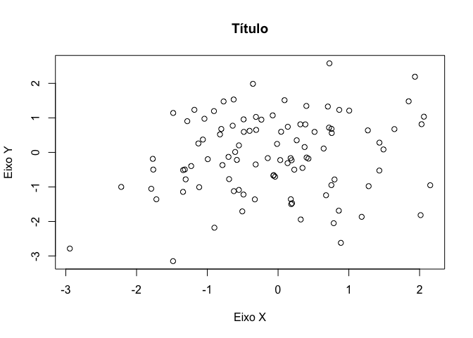<!-- -->

Criando um gráfico de contorno e um heatmap:

``` r
x <- seq(-pi, pi, length=50)
y <-  x 
f <-  outer(x, y, function(x, y)cos(y)/1+x^2)
contour(x, y, f)
contour(x, y, f, nlevels=45, add = T)
```

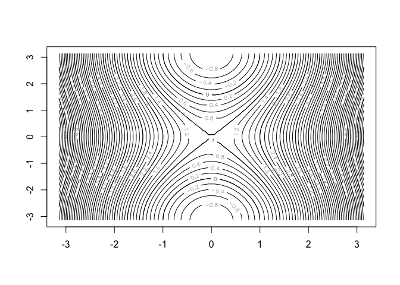<!-- -->

``` r
fa <- (f-t(f))/2
contour(x, y, fa, nlevels = 15)
```

<!-- -->

``` r
image(x,y,fa)
```

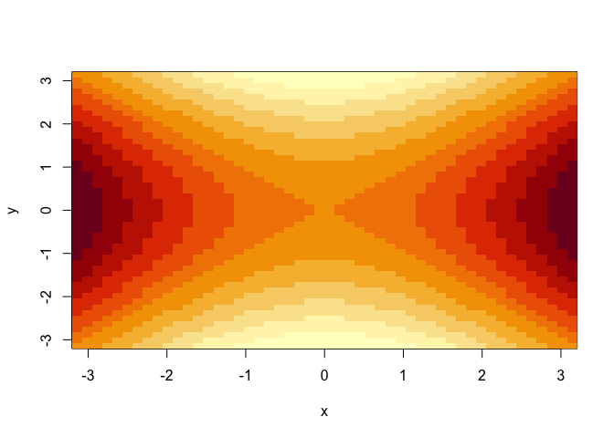<!-- -->

``` r
persp(x, y, fa, theta = 30, phi = 40)
```

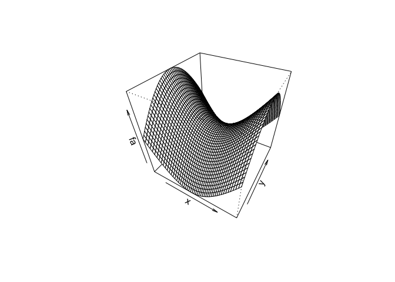<!-- -->

### Indexação de dados:

Selecionando, na segunda linha, o terceiro elemento de uma matriz:

``` r
A <- matrix(1:16, 4, 4)
A
```

    ##      [,1] [,2] [,3] [,4]
    ## [1,]    1    5    9   13
    ## [2,]    2    6   10   14
    ## [3,]    3    7   11   15
    ## [4,]    4    8   12   16

``` r
A[2,3]
```

    ## [1] 10

Lembrar que dentro de \[ \] o primeiro número se refere à linha e o
segundo à coluna Também é possível selecionar um conjunto de itens

``` r
A[c(1,3), c(2,4)]
```

    ##      [,1] [,2]
    ## [1,]    5   13
    ## [2,]    7   15

``` r
A[1:3, 2:4]
```

    ##      [,1] [,2] [,3]
    ## [1,]    5    9   13
    ## [2,]    6   10   14
    ## [3,]    7   11   15

``` r
A[1:2, ]
```

    ##      [,1] [,2] [,3] [,4]
    ## [1,]    1    5    9   13
    ## [2,]    2    6   10   14

``` r
A[, 1:2]
```

    ##      [,1] [,2]
    ## [1,]    1    5
    ## [2,]    2    6
    ## [3,]    3    7
    ## [4,]    4    8

### Bancos

#### O dataframe “Auto”

O livro sugere o *read.table*, mas o pacote *rio* permite importação de
vários formatos sem grandes esforços. Ao invés de *fix* para ver o
banco, o comando *View()* do RStudio é mais atual.

``` r
Auto <- read.table("Auto.data", header = T, na.strings = "?")
head(Auto)
```

    ##   mpg cylinders displacement horsepower weight acceleration year origin
    ## 1  18         8          307        130   3504         12.0   70      1
    ## 2  15         8          350        165   3693         11.5   70      1
    ## 3  18         8          318        150   3436         11.0   70      1
    ## 4  16         8          304        150   3433         12.0   70      1
    ## 5  17         8          302        140   3449         10.5   70      1
    ## 6  15         8          429        198   4341         10.0   70      1
    ##                        name
    ## 1 chevrolet chevelle malibu
    ## 2         buick skylark 320
    ## 3        plymouth satellite
    ## 4             amc rebel sst
    ## 5               ford torino
    ## 6          ford galaxie 500

``` r
dim(Auto)
```

    ## [1] 397   9

``` r
Auto[1:4, ]
```

    ##   mpg cylinders displacement horsepower weight acceleration year origin
    ## 1  18         8          307        130   3504         12.0   70      1
    ## 2  15         8          350        165   3693         11.5   70      1
    ## 3  18         8          318        150   3436         11.0   70      1
    ## 4  16         8          304        150   3433         12.0   70      1
    ##                        name
    ## 1 chevrolet chevelle malibu
    ## 2         buick skylark 320
    ## 3        plymouth satellite
    ## 4             amc rebel sst

``` r
Auto <- na.omit(Auto)
dim(Auto)
```

    ## [1] 392   9

``` r
names(Auto)
```

    ## [1] "mpg"          "cylinders"    "displacement" "horsepower"  
    ## [5] "weight"       "acceleration" "year"         "origin"      
    ## [9] "name"

Plotando:

``` r
plot(Auto$cylinders, Auto$mpg)
```

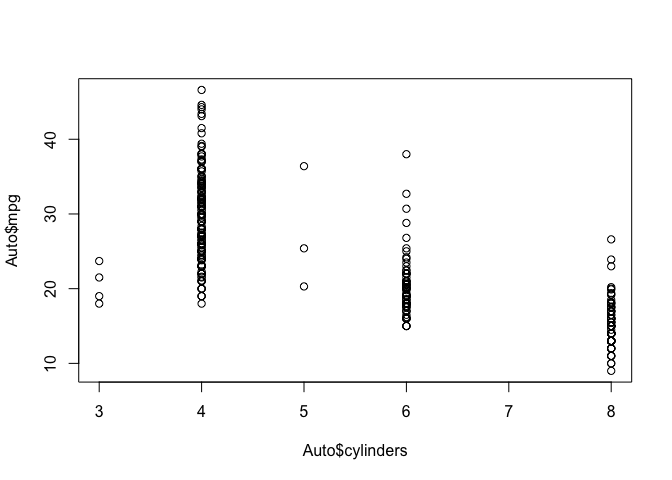<!-- -->

``` r
Auto$cylinders <- as.factor(Auto$cylinders)
plot(Auto$cylinders, Auto$mpg, col = "red", varwidth = T, xlab = "Cilindros", ylab = "Milhas por galão")
```

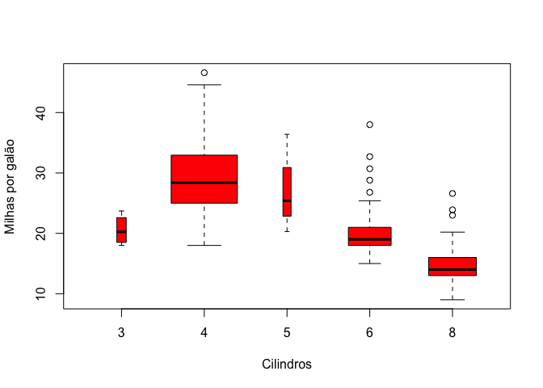<!-- -->

``` r
hist(Auto$mpg, col = 2, breaks = 15)
```

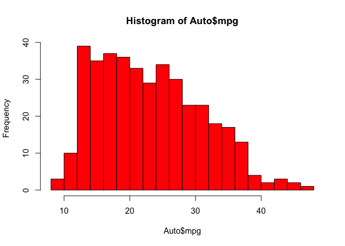<!-- -->

``` r
pairs(~Auto$mpg + Auto$displacement + Auto$horsepower + Auto$weight + Auto$acceleration, Auto)
```

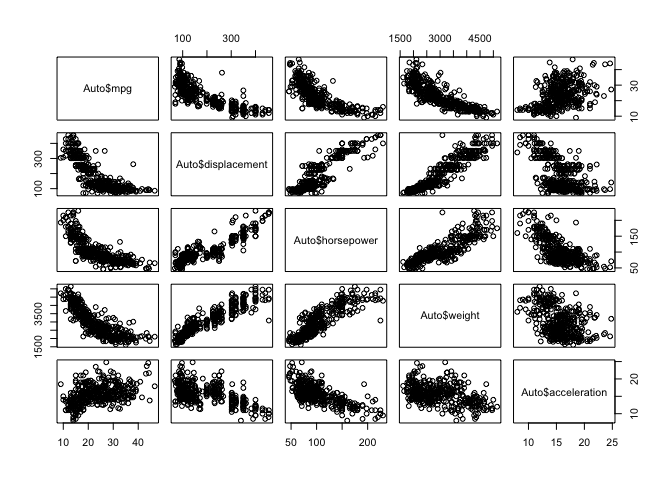<!-- -->

Função *summary*:

``` r
summary(Auto)
```

    ##       mpg        cylinders  displacement     horsepower        weight    
    ##  Min.   : 9.00   3:  4     Min.   : 68.0   Min.   : 46.0   Min.   :1613  
    ##  1st Qu.:17.00   4:199     1st Qu.:105.0   1st Qu.: 75.0   1st Qu.:2225  
    ##  Median :22.75   5:  3     Median :151.0   Median : 93.5   Median :2804  
    ##  Mean   :23.45   6: 83     Mean   :194.4   Mean   :104.5   Mean   :2978  
    ##  3rd Qu.:29.00   8:103     3rd Qu.:275.8   3rd Qu.:126.0   3rd Qu.:3615  
    ##  Max.   :46.60             Max.   :455.0   Max.   :230.0   Max.   :5140  
    ##                                                                          
    ##   acceleration        year           origin                      name    
    ##  Min.   : 8.00   Min.   :70.00   Min.   :1.000   amc matador       :  5  
    ##  1st Qu.:13.78   1st Qu.:73.00   1st Qu.:1.000   ford pinto        :  5  
    ##  Median :15.50   Median :76.00   Median :1.000   toyota corolla    :  5  
    ##  Mean   :15.54   Mean   :75.98   Mean   :1.577   amc gremlin       :  4  
    ##  3rd Qu.:17.02   3rd Qu.:79.00   3rd Qu.:2.000   amc hornet        :  4  
    ##  Max.   :24.80   Max.   :82.00   Max.   :3.000   chevrolet chevette:  4  
    ##                                                  (Other)           :365

``` r
summary(Auto$mpg)
```

    ##    Min. 1st Qu.  Median    Mean 3rd Qu.    Max. 
    ##    9.00   17.00   22.75   23.45   29.00   46.60

## Exercícios

### Conceituais

1.  Método flexível de aprendizagem: melhor ou pior?

<!-- end list -->

  - Melhor, pois com muitas observações e poucas variáveis limitamos o
    modelo.
  - Pior, pois com muitas variáveis (preditores) e poucas observações, a
    variância seria enorme, gerando o que ele chamou de *overfitting*
    (p. 22)
  - Melhor, pois quando é linear, muitos pressupostos são requeridos, o
    que torna o modelo muito restrito e pouco flexível.
  - Pior, pois uma variância enorme gera o mesmo problema observado em
    b.

<!-- end list -->

2.  Explicar se fazemos: uma regressão ou classificação, uma predição ou
    inferência, e dizer *n* (tamanho da amostra) e *p* (número de
    preditores), em cada caso.

<!-- end list -->

  - Regressão. Inferência. *n* = 500, *p* = 3.
  - Classificação. Predição. *n* = 20, *p* = 13.
  - Regressão. Predição. *n* = 52, *p* = 3.

<!-- end list -->

3.  Depois.

4.  Aplicações na vida real:

<!-- end list -->

  - Sucesso ou falha em projetos de crowdfunding na internet
      - Preditores: tipo de projeto (produto, serviço, etc); tempo para
        somar os recursos; valor mínimo e máximo; variedade de valores;
      - Ambos. Entender o que define o sucesso de um projeto de
        crowdfunding permite planejar melhor os próximos, podendo prever
        a situação de novos possíveis projetos
  - Reeleição de incumbente para o governo do estado
      - Preditores: pertencer ao partido do presidente; taxa de
        desemprego no estado; diminuição de impostos no período anterior
      - Predição
  - Sugestão de filmes da Netflix
      - Preditores: filmes assistidos anteriormente; idade e sexo do
        usuário
      - Ambos.

<!-- end list -->

5.  Modelos mais flexíveis x modelos menos flexíveis:

<!-- end list -->

  - Vantagem: Se adapta melhor aos dados
  - Desvantagem: Dificuldade de interpretar

<!-- end list -->

6.  Nos modelos paramétricos, a forma dos dados é assumida, e um modelo
    escolhido para tal forma. Nos não-paramétricos, tal forma não é
    assumida.

7.  Tabela pro KNN:

<!-- end list -->

``` r
table <- tibble::tibble("Obs" = c(1, 2, 3, 4, 5, 6,0), "X1" = c(0,2,0,0,-1,1,0), "X2" = c(3,0,1,1,0,1,0), "X3" = c(0,0,3,2,1,1,0), "Y" = c("Red","Red","Red", "Green", "Green", "Red", " "))
print(table)
```

    ## # A tibble: 7 x 5
    ##     Obs    X1    X2    X3 Y    
    ##   <dbl> <dbl> <dbl> <dbl> <chr>
    ## 1     1     0     3     0 Red  
    ## 2     2     2     0     0 Red  
    ## 3     3     0     1     3 Red  
    ## 4     4     0     1     2 Green
    ## 5     5    -1     0     1 Green
    ## 6     6     1     1     1 Red  
    ## 7     0     0     0     0 " "

  - Calculando a distância euclidiana:

<!-- end list -->

``` r
eucdist <- function(x, y) {
  sqrt(sum((x - y) ^ 2))
}
ob0 <- c(0,0,0)
ob1 <- c(0,3,0)
ob2 <- c(2,0,0)
ob3 <- c(0,1,3)
ob4 <- c(0,1,2)
ob5 <- c(-1,0,1)
ob6 <- c(1,1,1)

eucdist(ob1, ob0)
```

    ## [1] 3

``` r
eucdist(ob2, ob0)
```

    ## [1] 2

``` r
eucdist(ob3, ob0)
```

    ## [1] 3.162278

``` r
eucdist(ob4, ob0)
```

    ## [1] 2.236068

``` r
eucdist(ob5, ob0)
```

    ## [1] 1.414214

``` r
eucdist(ob6, ob0)
```

    ## [1] 1.732051

  - K = 1, 5ª observação (-1,0,1) de distância 1.41 do 0,0,0, sendo
    então predita como Verde.
  - K = 3, 5ª, 6ª e 2ª observações. Predição vermelha.
  - K tem que ser menor

### Aplicados

8.  Ler o banco College.csv e corrigir como solicitado

<!-- end list -->

``` r
library(ISLR)
```

    ## 
    ## Attaching package: 'ISLR'

    ## The following object is masked _by_ '.GlobalEnv':
    ## 
    ##     Auto

``` r
library(ggplot2)
```

    ## Registered S3 methods overwritten by 'ggplot2':
    ##   method         from 
    ##   [.quosures     rlang
    ##   c.quosures     rlang
    ##   print.quosures rlang

``` r
data(College)
dplyr::glimpse(College)
```

    ## Observations: 777
    ## Variables: 18
    ## $ Private     <fct> Yes, Yes, Yes, Yes, Yes, Yes, Yes, Yes, Yes, Yes, Ye…
    ## $ Apps        <dbl> 1660, 2186, 1428, 417, 193, 587, 353, 1899, 1038, 58…
    ## $ Accept      <dbl> 1232, 1924, 1097, 349, 146, 479, 340, 1720, 839, 498…
    ## $ Enroll      <dbl> 721, 512, 336, 137, 55, 158, 103, 489, 227, 172, 472…
    ## $ Top10perc   <dbl> 23, 16, 22, 60, 16, 38, 17, 37, 30, 21, 37, 44, 38, …
    ## $ Top25perc   <dbl> 52, 29, 50, 89, 44, 62, 45, 68, 63, 44, 75, 77, 64, …
    ## $ F.Undergrad <dbl> 2885, 2683, 1036, 510, 249, 678, 416, 1594, 973, 799…
    ## $ P.Undergrad <dbl> 537, 1227, 99, 63, 869, 41, 230, 32, 306, 78, 110, 4…
    ## $ Outstate    <dbl> 7440, 12280, 11250, 12960, 7560, 13500, 13290, 13868…
    ## $ Room.Board  <dbl> 3300, 6450, 3750, 5450, 4120, 3335, 5720, 4826, 4400…
    ## $ Books       <dbl> 450, 750, 400, 450, 800, 500, 500, 450, 300, 660, 50…
    ## $ Personal    <dbl> 2200, 1500, 1165, 875, 1500, 675, 1500, 850, 500, 18…
    ## $ PhD         <dbl> 70, 29, 53, 92, 76, 67, 90, 89, 79, 40, 82, 73, 60, …
    ## $ Terminal    <dbl> 78, 30, 66, 97, 72, 73, 93, 100, 84, 41, 88, 91, 84,…
    ## $ S.F.Ratio   <dbl> 18.1, 12.2, 12.9, 7.7, 11.9, 9.4, 11.5, 13.7, 11.3, …
    ## $ perc.alumni <dbl> 12, 16, 30, 37, 2, 11, 26, 37, 23, 15, 31, 41, 21, 3…
    ## $ Expend      <dbl> 7041, 10527, 8735, 19016, 10922, 9727, 8861, 11487, …
    ## $ Grad.Rate   <dbl> 60, 56, 54, 59, 15, 55, 63, 73, 80, 52, 73, 76, 74, …

``` r
pairs(College[,1:10])
```

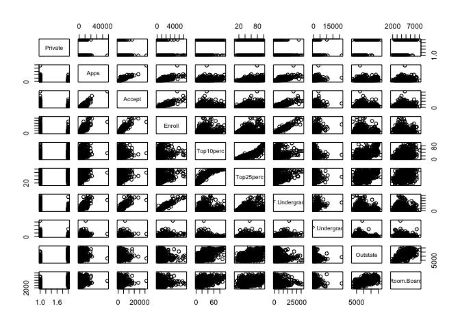<!-- -->

``` r
ggplot(College, aes(x = Private, y = Outstate, fill = Private))+
  geom_boxplot(show.legend = F)+
  labs(title = "Boxplot Private - Outstate",
       x = "Privada",
       y = "Fora do Estado",
       caption = "Fonte: Pacote ISLR")
```

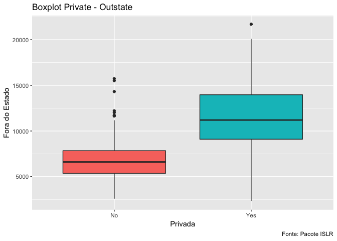<!-- -->

Criando variável Elite

``` r
library(tidyverse)
```

    ## ── Attaching packages ──────────────────────────────────────────────────────────── tidyverse 1.2.1 ──

    ## ✔ tibble  2.1.1     ✔ purrr   0.3.2
    ## ✔ tidyr   0.8.3     ✔ dplyr   0.8.1
    ## ✔ readr   1.3.1     ✔ stringr 1.4.0
    ## ✔ tibble  2.1.1     ✔ forcats 0.4.0

    ## ── Conflicts ─────────────────────────────────────────────────────────────── tidyverse_conflicts() ──
    ## ✖ dplyr::filter() masks stats::filter()
    ## ✖ dplyr::lag()    masks stats::lag()

``` r
Elite <- rep("No", nrow(College))
Elite[College$Top10perc>50] <- "Yes"
College <- data.frame(College, Elite)
summary(College)
```

    ##  Private        Apps           Accept          Enroll       Top10perc    
    ##  No :212   Min.   :   81   Min.   :   72   Min.   :  35   Min.   : 1.00  
    ##  Yes:565   1st Qu.:  776   1st Qu.:  604   1st Qu.: 242   1st Qu.:15.00  
    ##            Median : 1558   Median : 1110   Median : 434   Median :23.00  
    ##            Mean   : 3002   Mean   : 2019   Mean   : 780   Mean   :27.56  
    ##            3rd Qu.: 3624   3rd Qu.: 2424   3rd Qu.: 902   3rd Qu.:35.00  
    ##            Max.   :48094   Max.   :26330   Max.   :6392   Max.   :96.00  
    ##    Top25perc      F.Undergrad     P.Undergrad         Outstate    
    ##  Min.   :  9.0   Min.   :  139   Min.   :    1.0   Min.   : 2340  
    ##  1st Qu.: 41.0   1st Qu.:  992   1st Qu.:   95.0   1st Qu.: 7320  
    ##  Median : 54.0   Median : 1707   Median :  353.0   Median : 9990  
    ##  Mean   : 55.8   Mean   : 3700   Mean   :  855.3   Mean   :10441  
    ##  3rd Qu.: 69.0   3rd Qu.: 4005   3rd Qu.:  967.0   3rd Qu.:12925  
    ##  Max.   :100.0   Max.   :31643   Max.   :21836.0   Max.   :21700  
    ##    Room.Board       Books           Personal         PhD        
    ##  Min.   :1780   Min.   :  96.0   Min.   : 250   Min.   :  8.00  
    ##  1st Qu.:3597   1st Qu.: 470.0   1st Qu.: 850   1st Qu.: 62.00  
    ##  Median :4200   Median : 500.0   Median :1200   Median : 75.00  
    ##  Mean   :4358   Mean   : 549.4   Mean   :1341   Mean   : 72.66  
    ##  3rd Qu.:5050   3rd Qu.: 600.0   3rd Qu.:1700   3rd Qu.: 85.00  
    ##  Max.   :8124   Max.   :2340.0   Max.   :6800   Max.   :103.00  
    ##     Terminal       S.F.Ratio      perc.alumni        Expend     
    ##  Min.   : 24.0   Min.   : 2.50   Min.   : 0.00   Min.   : 3186  
    ##  1st Qu.: 71.0   1st Qu.:11.50   1st Qu.:13.00   1st Qu.: 6751  
    ##  Median : 82.0   Median :13.60   Median :21.00   Median : 8377  
    ##  Mean   : 79.7   Mean   :14.09   Mean   :22.74   Mean   : 9660  
    ##  3rd Qu.: 92.0   3rd Qu.:16.50   3rd Qu.:31.00   3rd Qu.:10830  
    ##  Max.   :100.0   Max.   :39.80   Max.   :64.00   Max.   :56233  
    ##    Grad.Rate      Elite    
    ##  Min.   : 10.00   No :699  
    ##  1st Qu.: 53.00   Yes: 78  
    ##  Median : 65.00            
    ##  Mean   : 65.46            
    ##  3rd Qu.: 78.00            
    ##  Max.   :118.00

``` r
ggplot(College, aes(x = Elite, y = Outstate, fill = Elite ))+
  geom_boxplot()
```

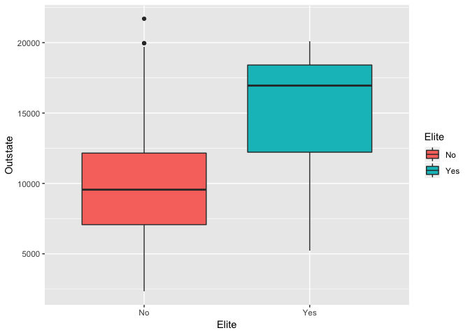<!-- -->

``` r
ggplot(College, aes(x = Expend))+
  geom_histogram(fill = "orange", bins = 50)
```

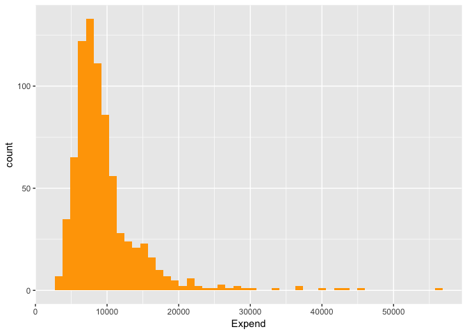<!-- -->

9.  Usar o banco Auto, disponível tanto no repositório do github quanto
    no pacote ISLR

<!-- end list -->

``` r
library(ISLR)
data(Auto)
glimpse(Auto)
```

    ## Observations: 392
    ## Variables: 9
    ## $ mpg          <dbl> 18, 15, 18, 16, 17, 15, 14, 14, 14, 15, 15, 14, 15,…
    ## $ cylinders    <dbl> 8, 8, 8, 8, 8, 8, 8, 8, 8, 8, 8, 8, 8, 8, 4, 6, 6, …
    ## $ displacement <dbl> 307, 350, 318, 304, 302, 429, 454, 440, 455, 390, 3…
    ## $ horsepower   <dbl> 130, 165, 150, 150, 140, 198, 220, 215, 225, 190, 1…
    ## $ weight       <dbl> 3504, 3693, 3436, 3433, 3449, 4341, 4354, 4312, 442…
    ## $ acceleration <dbl> 12.0, 11.5, 11.0, 12.0, 10.5, 10.0, 9.0, 8.5, 10.0,…
    ## $ year         <dbl> 70, 70, 70, 70, 70, 70, 70, 70, 70, 70, 70, 70, 70,…
    ## $ origin       <dbl> 1, 1, 1, 1, 1, 1, 1, 1, 1, 1, 1, 1, 1, 1, 3, 1, 1, …
    ## $ name         <fct> chevrolet chevelle malibu, buick skylark 320, plymo…

``` r
summary(Auto)
```

    ##       mpg          cylinders      displacement     horsepower   
    ##  Min.   : 9.00   Min.   :3.000   Min.   : 68.0   Min.   : 46.0  
    ##  1st Qu.:17.00   1st Qu.:4.000   1st Qu.:105.0   1st Qu.: 75.0  
    ##  Median :22.75   Median :4.000   Median :151.0   Median : 93.5  
    ##  Mean   :23.45   Mean   :5.472   Mean   :194.4   Mean   :104.5  
    ##  3rd Qu.:29.00   3rd Qu.:8.000   3rd Qu.:275.8   3rd Qu.:126.0  
    ##  Max.   :46.60   Max.   :8.000   Max.   :455.0   Max.   :230.0  
    ##                                                                 
    ##      weight      acceleration        year           origin     
    ##  Min.   :1613   Min.   : 8.00   Min.   :70.00   Min.   :1.000  
    ##  1st Qu.:2225   1st Qu.:13.78   1st Qu.:73.00   1st Qu.:1.000  
    ##  Median :2804   Median :15.50   Median :76.00   Median :1.000  
    ##  Mean   :2978   Mean   :15.54   Mean   :75.98   Mean   :1.577  
    ##  3rd Qu.:3615   3rd Qu.:17.02   3rd Qu.:79.00   3rd Qu.:2.000  
    ##  Max.   :5140   Max.   :24.80   Max.   :82.00   Max.   :3.000  
    ##                                                                
    ##                  name    
    ##  amc matador       :  5  
    ##  ford pinto        :  5  
    ##  toyota corolla    :  5  
    ##  amc gremlin       :  4  
    ##  amc hornet        :  4  
    ##  chevrolet chevette:  4  
    ##  (Other)           :365

``` r
sapply(Auto[,1:7], mean)
```

    ##          mpg    cylinders displacement   horsepower       weight 
    ##    23.445918     5.471939   194.411990   104.469388  2977.584184 
    ## acceleration         year 
    ##    15.541327    75.979592

``` r
sapply(Auto[,1:7], sd)
```

    ##          mpg    cylinders displacement   horsepower       weight 
    ##     7.805007     1.705783   104.644004    38.491160   849.402560 
    ## acceleration         year 
    ##     2.758864     3.683737

``` r
# Minha função está dando erro, não sei porque
# meansd <- function(x) {
#   media <- map(x, mean)
#   desvpd <- map(x, sd)
#   tibble(media, desvpd)
# }
# 
# meansd(Auto[ ,1:7])

Auto1085 <- Auto[-(10:85),]

# meansd(Auto1085)

pairs(Auto[,1:7])
```

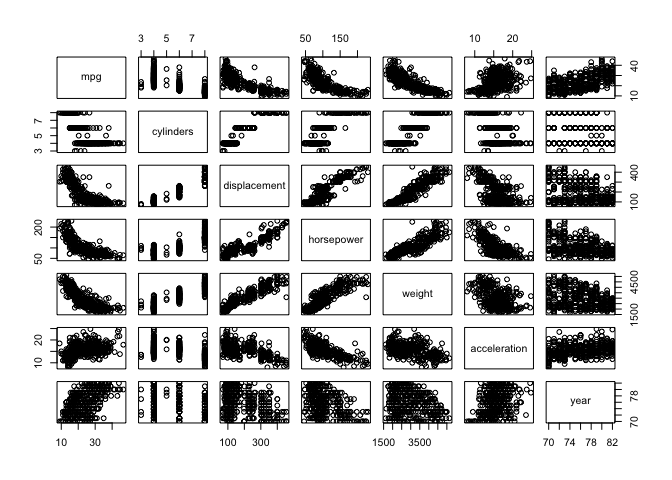<!-- -->

10. Usando o banco Boston, disponível no MASS:

<!-- end list -->

``` r
library(MASS)
```

    ## 
    ## Attaching package: 'MASS'

    ## The following object is masked from 'package:dplyr':
    ## 
    ##     select

``` r
data(Boston)
dplyr::glimpse(Boston)
```

    ## Observations: 506
    ## Variables: 14
    ## $ crim    <dbl> 0.00632, 0.02731, 0.02729, 0.03237, 0.06905, 0.02985, 0.…
    ## $ zn      <dbl> 18.0, 0.0, 0.0, 0.0, 0.0, 0.0, 12.5, 12.5, 12.5, 12.5, 1…
    ## $ indus   <dbl> 2.31, 7.07, 7.07, 2.18, 2.18, 2.18, 7.87, 7.87, 7.87, 7.…
    ## $ chas    <int> 0, 0, 0, 0, 0, 0, 0, 0, 0, 0, 0, 0, 0, 0, 0, 0, 0, 0, 0,…
    ## $ nox     <dbl> 0.538, 0.469, 0.469, 0.458, 0.458, 0.458, 0.524, 0.524, …
    ## $ rm      <dbl> 6.575, 6.421, 7.185, 6.998, 7.147, 6.430, 6.012, 6.172, …
    ## $ age     <dbl> 65.2, 78.9, 61.1, 45.8, 54.2, 58.7, 66.6, 96.1, 100.0, 8…
    ## $ dis     <dbl> 4.0900, 4.9671, 4.9671, 6.0622, 6.0622, 6.0622, 5.5605, …
    ## $ rad     <int> 1, 2, 2, 3, 3, 3, 5, 5, 5, 5, 5, 5, 5, 4, 4, 4, 4, 4, 4,…
    ## $ tax     <dbl> 296, 242, 242, 222, 222, 222, 311, 311, 311, 311, 311, 3…
    ## $ ptratio <dbl> 15.3, 17.8, 17.8, 18.7, 18.7, 18.7, 15.2, 15.2, 15.2, 15…
    ## $ black   <dbl> 396.90, 396.90, 392.83, 394.63, 396.90, 394.12, 395.60, …
    ## $ lstat   <dbl> 4.98, 9.14, 4.03, 2.94, 5.33, 5.21, 12.43, 19.15, 29.93,…
    ## $ medv    <dbl> 24.0, 21.6, 34.7, 33.4, 36.2, 28.7, 22.9, 27.1, 16.5, 18…

``` r
pairs(Boston)
```

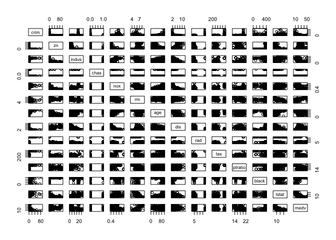<!-- -->
