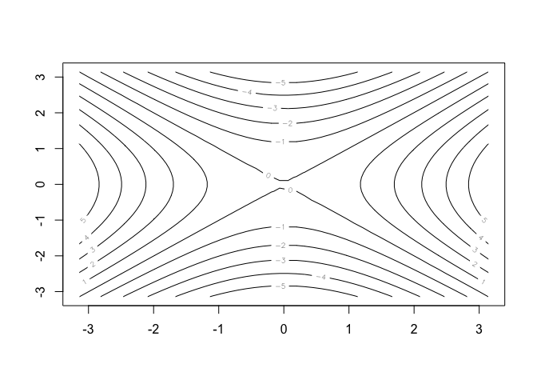

Capítulo 2 - Statistical Learning
================
Mateus C. Pestana

## 2.3 Lab: Introduction to R

### Comandos básicos

#### Dando input usando \<-

``` r
x <- c(1,3,2,5)
x 
```

    ## [1] 1 3 2 5

#### Dando input usando =

``` r
x = c(1,6,2)
x
```

    ## [1] 1 6 2

``` r
y = c(1,4,3)
y
```

    ## [1] 1 4 3

#### Somando os objetos:

``` r
x + y
```

    ## [1]  2 10  5

#### Listando e removendo os objetos criados:

``` r
ls()
```

    ## [1] "x" "y"

``` r
rm(x, y)
ls()
```

    ## character(0)

#### Pedindo ajuda do pacote **matrix**

``` r
?matrix
```

***Comentário**: Acho que criar matrizes é mais interessante usando a
função *frame\_matrix()* do pacote *tibble* do *Tidyverse*. A criação da
mesma matriz da página 44 do livro se daria de uma forma mais legível:*

``` r
x <- tibble::frame_matrix(
  ~",1", ~",2",
      1,     3,
      2,     4
  )
```

#### Funções estatísticas:

``` r
sqrt(x) 
```

    ##            ,1       ,2
    ## [1,] 1.000000 1.732051
    ## [2,] 1.414214 2.000000

``` r
x^2 
```

    ##      ,1 ,2
    ## [1,]  1  9
    ## [2,]  4 16

``` r
x <-  rnorm(50) 
y <-  x + rnorm(50, mean = 50, sd = 0.1) 
cor(x,y)
```

    ## [1] 0.9948051

``` r
y <-  rnorm(100)
mean(y)
```

    ## [1] 0.01987218

``` r
var(y)
```

    ## [1] 0.8947598

``` r
sqrt(var(y))
```

    ## [1] 0.9459175

``` r
sd(y)
```

    ## [1] 0.9459175

### Criando gráficos com o pacote *graphics* (r base)

Para fazer gráficos, acho o \*ggplot\*\* mais intuitivo, apesar de que,
nesse caso do livro, é mais fácil digitar *plot(x,y)*:

``` r
set.seed(666)
x <-  rnorm(100)
y <- rnorm(100)
plot(x,y, xlab = "Eixo X", ylab = "Eixo Y", main = "Título")
```

<!-- -->

Criando um gráfico de contorno e um heatmap:

``` r
x <- seq(-pi, pi, length=50)
y <-  x 
f <-  outer(x, y, function(x, y)cos(y)/1+x^2)
contour(x, y, f)
contour(x, y, f, nlevels=45, add = T)
```

<!-- -->

``` r
fa <- (f-t(f))/2
contour(x, y, fa, nlevels = 15)
```

<!-- -->

``` r
image(x,y,fa)
```

<!-- -->

``` r
persp(x, y, fa, theta = 30, phi = 40)
```

<!-- -->

### Indexação de dados:

Selecionando, na segunda linha, o terceiro elemento de uma matriz:

``` r
A <- matrix(1:16, 4, 4)
A
```

    ##      [,1] [,2] [,3] [,4]
    ## [1,]    1    5    9   13
    ## [2,]    2    6   10   14
    ## [3,]    3    7   11   15
    ## [4,]    4    8   12   16

``` r
A[2,3]
```

    ## [1] 10

Lembrar que dentro de \[ \] o primeiro número se refere à linha e o
segundo à coluna Também é possível selecionar um conjunto de itens

``` r
A[c(1,3), c(2,4)]
```

    ##      [,1] [,2]
    ## [1,]    5   13
    ## [2,]    7   15

``` r
A[1:3, 2:4]
```

    ##      [,1] [,2] [,3]
    ## [1,]    5    9   13
    ## [2,]    6   10   14
    ## [3,]    7   11   15

``` r
A[1:2, ]
```

    ##      [,1] [,2] [,3] [,4]
    ## [1,]    1    5    9   13
    ## [2,]    2    6   10   14

``` r
A[, 1:2]
```

    ##      [,1] [,2]
    ## [1,]    1    5
    ## [2,]    2    6
    ## [3,]    3    7
    ## [4,]    4    8

### Bancos

#### O dataframe “Auto”

O livro sugere o *read.table*, mas o pacote *rio* permite importação de
vários formatos sem grandes esforços. Ao invés de *fix* para ver o
banco, o comando *View()* do RStudio é mais atual.

``` r
Auto <- read.table("Auto.data", header = T, na.strings = "?")
head(Auto)
```

    ##   mpg cylinders displacement horsepower weight acceleration year origin
    ## 1  18         8          307        130   3504         12.0   70      1
    ## 2  15         8          350        165   3693         11.5   70      1
    ## 3  18         8          318        150   3436         11.0   70      1
    ## 4  16         8          304        150   3433         12.0   70      1
    ## 5  17         8          302        140   3449         10.5   70      1
    ## 6  15         8          429        198   4341         10.0   70      1
    ##                        name
    ## 1 chevrolet chevelle malibu
    ## 2         buick skylark 320
    ## 3        plymouth satellite
    ## 4             amc rebel sst
    ## 5               ford torino
    ## 6          ford galaxie 500

``` r
dim(Auto)
```

    ## [1] 397   9

``` r
Auto[1:4, ]
```

    ##   mpg cylinders displacement horsepower weight acceleration year origin
    ## 1  18         8          307        130   3504         12.0   70      1
    ## 2  15         8          350        165   3693         11.5   70      1
    ## 3  18         8          318        150   3436         11.0   70      1
    ## 4  16         8          304        150   3433         12.0   70      1
    ##                        name
    ## 1 chevrolet chevelle malibu
    ## 2         buick skylark 320
    ## 3        plymouth satellite
    ## 4             amc rebel sst

``` r
Auto <- na.omit(Auto)
dim(Auto)
```

    ## [1] 392   9

``` r
names(Auto)
```

    ## [1] "mpg"          "cylinders"    "displacement" "horsepower"  
    ## [5] "weight"       "acceleration" "year"         "origin"      
    ## [9] "name"

Plotando:

``` r
plot(Auto$cylinders, Auto$mpg)
```

<!-- -->

``` r
Auto$cylinders <- as.factor(Auto$cylinders)
plot(Auto$cylinders, Auto$mpg, col = "red", varwidth = T, xlab = "Cilindros", ylab = "Milhas por galão")
```

<!-- -->

``` r
hist(Auto$mpg, col = 2, breaks = 15)
```

<!-- -->

``` r
pairs(~Auto$mpg + Auto$displacement + Auto$horsepower + Auto$weight + Auto$acceleration, Auto)
```

<!-- -->

Função *summary*:

``` r
summary(Auto)
```

    ##       mpg        cylinders  displacement     horsepower        weight    
    ##  Min.   : 9.00   3:  4     Min.   : 68.0   Min.   : 46.0   Min.   :1613  
    ##  1st Qu.:17.00   4:199     1st Qu.:105.0   1st Qu.: 75.0   1st Qu.:2225  
    ##  Median :22.75   5:  3     Median :151.0   Median : 93.5   Median :2804  
    ##  Mean   :23.45   6: 83     Mean   :194.4   Mean   :104.5   Mean   :2978  
    ##  3rd Qu.:29.00   8:103     3rd Qu.:275.8   3rd Qu.:126.0   3rd Qu.:3615  
    ##  Max.   :46.60             Max.   :455.0   Max.   :230.0   Max.   :5140  
    ##                                                                          
    ##   acceleration        year           origin                      name    
    ##  Min.   : 8.00   Min.   :70.00   Min.   :1.000   amc matador       :  5  
    ##  1st Qu.:13.78   1st Qu.:73.00   1st Qu.:1.000   ford pinto        :  5  
    ##  Median :15.50   Median :76.00   Median :1.000   toyota corolla    :  5  
    ##  Mean   :15.54   Mean   :75.98   Mean   :1.577   amc gremlin       :  4  
    ##  3rd Qu.:17.02   3rd Qu.:79.00   3rd Qu.:2.000   amc hornet        :  4  
    ##  Max.   :24.80   Max.   :82.00   Max.   :3.000   chevrolet chevette:  4  
    ##                                                  (Other)           :365

``` r
summary(Auto$mpg)
```

    ##    Min. 1st Qu.  Median    Mean 3rd Qu.    Max. 
    ##    9.00   17.00   22.75   23.45   29.00   46.60

## Exercícios

### Conceituais

1.  Método flexível de aprendizagem: melhor ou pior?

<!-- end list -->

  - Melhor, pois com muitas observações e poucas variáveis limitamos o
    modelo.
  - Pior, pois com muitas variáveis (preditores) e poucas observações, a
    variância seria enorme, gerando o que ele chamou de *overfitting*
    (p. 22)
  - Melhor, pois quando é linear, muitos pressupostos são requeridos, o
    que torna o modelo muito restrito e pouco flexível.
  - Pior, pois uma variância enorme gera o mesmo problema observado em
    b.

<!-- end list -->

2.  Explicar se fazemos: uma regressão ou classificação, uma predição ou
    inferência, e dizer *n* (tamanho da amostra) e *p* (número de
    preditores), em cada caso.

<!-- end list -->

  - Regressão. Inferência. *n* = 500, *p* = 3.
  - Classificação. Predição. *n* = 20, *p* = 13.
  - Regressão. Predição. *n* = 52, *p* = 3.

<!-- end list -->

3.  Depois.

4.  Aplicações na vida real:

<!-- end list -->

  - Sucesso ou falha em projetos de crowdfunding na internet
      - Preditores: tipo de projeto (produto, serviço, etc); tempo para
        somar os recursos; valor mínimo e máximo; variedade de valores;
      - Ambos. Entender o que define o sucesso de um projeto de
        crowdfunding permite planejar melhor os próximos, podendo prever
        a situação de novos possíveis projetos
  - Reeleição de incumbente para o governo do estado
      - Preditores: pertencer ao partido do presidente; taxa de
        desemprego no estado; diminuição de impostos no período anterior
      - Predição
  - Sugestão de filmes da Netflix
      - Preditores: filmes assistidos anteriormente; idade e sexo do
        usuário
      - Ambos.

<!-- end list -->

5.  Modelos mais flexíveis x modelos menos flexíveis:

<!-- end list -->

  - Vantagem: Se adapta melhor aos dados
  - Desvantagem: Dificuldade de interpretar

<!-- end list -->

6.  Nos modelos paramétricos, a forma dos dados é assumida, e um modelo
    escolhido para tal forma. Nos não-paramétricos, tal forma não é
    assumida.

7.  Tabela pro KNN:

<!-- end list -->

``` r
table <- tibble::tibble("Obs" = c(1, 2, 3, 4, 5, 6,0), "X1" = c(0,2,0,0,-1,1,0), "X2" = c(3,0,1,1,0,1,0), "X3" = c(0,0,3,2,1,1,0), "Y" = c("Red","Red","Red", "Green", "Green", "Red", " "))
print(table)
```

    ## # A tibble: 7 x 5
    ##     Obs    X1    X2    X3 Y    
    ##   <dbl> <dbl> <dbl> <dbl> <chr>
    ## 1     1     0     3     0 Red  
    ## 2     2     2     0     0 Red  
    ## 3     3     0     1     3 Red  
    ## 4     4     0     1     2 Green
    ## 5     5    -1     0     1 Green
    ## 6     6     1     1     1 Red  
    ## 7     0     0     0     0 " "

  - Calculando a distância euclidiana:

<!-- end list -->

``` r
eucdist <- function(x, y) {
  sqrt(sum((x - y) ^ 2))
}
ob0 <- c(0,0,0)
ob1 <- c(0,3,0)
ob2 <- c(2,0,0)
ob3 <- c(0,1,3)
ob4 <- c(0,1,2)
ob5 <- c(-1,0,1)
ob6 <- c(1,1,1)

eucdist(ob1, ob0)
```

    ## [1] 3

``` r
eucdist(ob2, ob0)
```

    ## [1] 2

``` r
eucdist(ob3, ob0)
```

    ## [1] 3.162278

``` r
eucdist(ob4, ob0)
```

    ## [1] 2.236068

``` r
eucdist(ob5, ob0)
```

    ## [1] 1.414214

``` r
eucdist(ob6, ob0)
```

    ## [1] 1.732051

  - K = 1, 5ª observação (-1,0,1) de distância 1.41 do 0,0,0, sendo
    então predita como Verde.
  - K = 3, 5ª, 6ª e 2ª observações. Predição vermelha.
  - K tem que ser menor

### Aplicados

8.  Ler o banco College.csv e corrigir como solicitado

<!-- end list -->

``` r
library(ISLR)
```

    ## 
    ## Attaching package: 'ISLR'

    ## The following object is masked _by_ '.GlobalEnv':
    ## 
    ##     Auto

``` r
library(ggplot2)
```

    ## Registered S3 methods overwritten by 'ggplot2':
    ##   method         from 
    ##   [.quosures     rlang
    ##   c.quosures     rlang
    ##   print.quosures rlang

``` r
data(College)
dplyr::glimpse(College)
```

    ## Observations: 777
    ## Variables: 18
    ## $ Private     <fct> Yes, Yes, Yes, Yes, Yes, Yes, Yes, Yes, Yes, Yes, Ye…
    ## $ Apps        <dbl> 1660, 2186, 1428, 417, 193, 587, 353, 1899, 1038, 58…
    ## $ Accept      <dbl> 1232, 1924, 1097, 349, 146, 479, 340, 1720, 839, 498…
    ## $ Enroll      <dbl> 721, 512, 336, 137, 55, 158, 103, 489, 227, 172, 472…
    ## $ Top10perc   <dbl> 23, 16, 22, 60, 16, 38, 17, 37, 30, 21, 37, 44, 38, …
    ## $ Top25perc   <dbl> 52, 29, 50, 89, 44, 62, 45, 68, 63, 44, 75, 77, 64, …
    ## $ F.Undergrad <dbl> 2885, 2683, 1036, 510, 249, 678, 416, 1594, 973, 799…
    ## $ P.Undergrad <dbl> 537, 1227, 99, 63, 869, 41, 230, 32, 306, 78, 110, 4…
    ## $ Outstate    <dbl> 7440, 12280, 11250, 12960, 7560, 13500, 13290, 13868…
    ## $ Room.Board  <dbl> 3300, 6450, 3750, 5450, 4120, 3335, 5720, 4826, 4400…
    ## $ Books       <dbl> 450, 750, 400, 450, 800, 500, 500, 450, 300, 660, 50…
    ## $ Personal    <dbl> 2200, 1500, 1165, 875, 1500, 675, 1500, 850, 500, 18…
    ## $ PhD         <dbl> 70, 29, 53, 92, 76, 67, 90, 89, 79, 40, 82, 73, 60, …
    ## $ Terminal    <dbl> 78, 30, 66, 97, 72, 73, 93, 100, 84, 41, 88, 91, 84,…
    ## $ S.F.Ratio   <dbl> 18.1, 12.2, 12.9, 7.7, 11.9, 9.4, 11.5, 13.7, 11.3, …
    ## $ perc.alumni <dbl> 12, 16, 30, 37, 2, 11, 26, 37, 23, 15, 31, 41, 21, 3…
    ## $ Expend      <dbl> 7041, 10527, 8735, 19016, 10922, 9727, 8861, 11487, …
    ## $ Grad.Rate   <dbl> 60, 56, 54, 59, 15, 55, 63, 73, 80, 52, 73, 76, 74, …

``` r
pairs(College[,1:10])
```

<!-- -->

``` r
ggplot(College, aes(x = Private, y = Outstate, fill = Private))+
  geom_boxplot(show.legend = F)+
  labs(title = "Boxplot Private - Outstate",
       x = "Privada",
       y = "Fora do Estado",
       caption = "Fonte: Pacote ISLR")
```

<!-- -->

Criando variável Elite

``` r
library(tidyverse)
```

    ## ── Attaching packages ──────────────────────────────────────────────────────────── tidyverse 1.2.1 ──

    ## ✔ tibble  2.1.1     ✔ purrr   0.3.2
    ## ✔ tidyr   0.8.3     ✔ dplyr   0.8.1
    ## ✔ readr   1.3.1     ✔ stringr 1.4.0
    ## ✔ tibble  2.1.1     ✔ forcats 0.4.0

    ## ── Conflicts ─────────────────────────────────────────────────────────────── tidyverse_conflicts() ──
    ## ✖ dplyr::filter() masks stats::filter()
    ## ✖ dplyr::lag()    masks stats::lag()

``` r
Elite <- rep("No", nrow(College))
Elite[College$Top10perc>50] <- "Yes"
College <- data.frame(College, Elite)
summary(College)
```

    ##  Private        Apps           Accept          Enroll       Top10perc    
    ##  No :212   Min.   :   81   Min.   :   72   Min.   :  35   Min.   : 1.00  
    ##  Yes:565   1st Qu.:  776   1st Qu.:  604   1st Qu.: 242   1st Qu.:15.00  
    ##            Median : 1558   Median : 1110   Median : 434   Median :23.00  
    ##            Mean   : 3002   Mean   : 2019   Mean   : 780   Mean   :27.56  
    ##            3rd Qu.: 3624   3rd Qu.: 2424   3rd Qu.: 902   3rd Qu.:35.00  
    ##            Max.   :48094   Max.   :26330   Max.   :6392   Max.   :96.00  
    ##    Top25perc      F.Undergrad     P.Undergrad         Outstate    
    ##  Min.   :  9.0   Min.   :  139   Min.   :    1.0   Min.   : 2340  
    ##  1st Qu.: 41.0   1st Qu.:  992   1st Qu.:   95.0   1st Qu.: 7320  
    ##  Median : 54.0   Median : 1707   Median :  353.0   Median : 9990  
    ##  Mean   : 55.8   Mean   : 3700   Mean   :  855.3   Mean   :10441  
    ##  3rd Qu.: 69.0   3rd Qu.: 4005   3rd Qu.:  967.0   3rd Qu.:12925  
    ##  Max.   :100.0   Max.   :31643   Max.   :21836.0   Max.   :21700  
    ##    Room.Board       Books           Personal         PhD        
    ##  Min.   :1780   Min.   :  96.0   Min.   : 250   Min.   :  8.00  
    ##  1st Qu.:3597   1st Qu.: 470.0   1st Qu.: 850   1st Qu.: 62.00  
    ##  Median :4200   Median : 500.0   Median :1200   Median : 75.00  
    ##  Mean   :4358   Mean   : 549.4   Mean   :1341   Mean   : 72.66  
    ##  3rd Qu.:5050   3rd Qu.: 600.0   3rd Qu.:1700   3rd Qu.: 85.00  
    ##  Max.   :8124   Max.   :2340.0   Max.   :6800   Max.   :103.00  
    ##     Terminal       S.F.Ratio      perc.alumni        Expend     
    ##  Min.   : 24.0   Min.   : 2.50   Min.   : 0.00   Min.   : 3186  
    ##  1st Qu.: 71.0   1st Qu.:11.50   1st Qu.:13.00   1st Qu.: 6751  
    ##  Median : 82.0   Median :13.60   Median :21.00   Median : 8377  
    ##  Mean   : 79.7   Mean   :14.09   Mean   :22.74   Mean   : 9660  
    ##  3rd Qu.: 92.0   3rd Qu.:16.50   3rd Qu.:31.00   3rd Qu.:10830  
    ##  Max.   :100.0   Max.   :39.80   Max.   :64.00   Max.   :56233  
    ##    Grad.Rate      Elite    
    ##  Min.   : 10.00   No :699  
    ##  1st Qu.: 53.00   Yes: 78  
    ##  Median : 65.00            
    ##  Mean   : 65.46            
    ##  3rd Qu.: 78.00            
    ##  Max.   :118.00

``` r
ggplot(College, aes(x = Elite, y = Outstate, fill = Elite ))+
  geom_boxplot()
```

<!-- -->

``` r
ggplot(College, aes(x = Expend))+
  geom_histogram(fill = "orange", bins = 50)
```

<!-- -->

9.  Usar o banco Auto, disponível tanto no repositório do github quanto
    no pacote ISLR

<!-- end list -->

``` r
library(ISLR)
data(Auto)
force(Auto)
```

    ##      mpg cylinders displacement horsepower weight acceleration year origin
    ## 1   18.0         8        307.0        130   3504         12.0   70      1
    ## 2   15.0         8        350.0        165   3693         11.5   70      1
    ## 3   18.0         8        318.0        150   3436         11.0   70      1
    ## 4   16.0         8        304.0        150   3433         12.0   70      1
    ## 5   17.0         8        302.0        140   3449         10.5   70      1
    ## 6   15.0         8        429.0        198   4341         10.0   70      1
    ## 7   14.0         8        454.0        220   4354          9.0   70      1
    ## 8   14.0         8        440.0        215   4312          8.5   70      1
    ## 9   14.0         8        455.0        225   4425         10.0   70      1
    ## 10  15.0         8        390.0        190   3850          8.5   70      1
    ## 11  15.0         8        383.0        170   3563         10.0   70      1
    ## 12  14.0         8        340.0        160   3609          8.0   70      1
    ## 13  15.0         8        400.0        150   3761          9.5   70      1
    ## 14  14.0         8        455.0        225   3086         10.0   70      1
    ## 15  24.0         4        113.0         95   2372         15.0   70      3
    ## 16  22.0         6        198.0         95   2833         15.5   70      1
    ## 17  18.0         6        199.0         97   2774         15.5   70      1
    ## 18  21.0         6        200.0         85   2587         16.0   70      1
    ## 19  27.0         4         97.0         88   2130         14.5   70      3
    ## 20  26.0         4         97.0         46   1835         20.5   70      2
    ## 21  25.0         4        110.0         87   2672         17.5   70      2
    ## 22  24.0         4        107.0         90   2430         14.5   70      2
    ## 23  25.0         4        104.0         95   2375         17.5   70      2
    ## 24  26.0         4        121.0        113   2234         12.5   70      2
    ## 25  21.0         6        199.0         90   2648         15.0   70      1
    ## 26  10.0         8        360.0        215   4615         14.0   70      1
    ## 27  10.0         8        307.0        200   4376         15.0   70      1
    ## 28  11.0         8        318.0        210   4382         13.5   70      1
    ## 29   9.0         8        304.0        193   4732         18.5   70      1
    ## 30  27.0         4         97.0         88   2130         14.5   71      3
    ## 31  28.0         4        140.0         90   2264         15.5   71      1
    ## 32  25.0         4        113.0         95   2228         14.0   71      3
    ## 34  19.0         6        232.0        100   2634         13.0   71      1
    ## 35  16.0         6        225.0        105   3439         15.5   71      1
    ## 36  17.0         6        250.0        100   3329         15.5   71      1
    ## 37  19.0         6        250.0         88   3302         15.5   71      1
    ## 38  18.0         6        232.0        100   3288         15.5   71      1
    ## 39  14.0         8        350.0        165   4209         12.0   71      1
    ## 40  14.0         8        400.0        175   4464         11.5   71      1
    ## 41  14.0         8        351.0        153   4154         13.5   71      1
    ## 42  14.0         8        318.0        150   4096         13.0   71      1
    ## 43  12.0         8        383.0        180   4955         11.5   71      1
    ## 44  13.0         8        400.0        170   4746         12.0   71      1
    ## 45  13.0         8        400.0        175   5140         12.0   71      1
    ## 46  18.0         6        258.0        110   2962         13.5   71      1
    ## 47  22.0         4        140.0         72   2408         19.0   71      1
    ## 48  19.0         6        250.0        100   3282         15.0   71      1
    ## 49  18.0         6        250.0         88   3139         14.5   71      1
    ## 50  23.0         4        122.0         86   2220         14.0   71      1
    ## 51  28.0         4        116.0         90   2123         14.0   71      2
    ## 52  30.0         4         79.0         70   2074         19.5   71      2
    ## 53  30.0         4         88.0         76   2065         14.5   71      2
    ## 54  31.0         4         71.0         65   1773         19.0   71      3
    ## 55  35.0         4         72.0         69   1613         18.0   71      3
    ## 56  27.0         4         97.0         60   1834         19.0   71      2
    ## 57  26.0         4         91.0         70   1955         20.5   71      1
    ## 58  24.0         4        113.0         95   2278         15.5   72      3
    ## 59  25.0         4         97.5         80   2126         17.0   72      1
    ## 60  23.0         4         97.0         54   2254         23.5   72      2
    ## 61  20.0         4        140.0         90   2408         19.5   72      1
    ## 62  21.0         4        122.0         86   2226         16.5   72      1
    ## 63  13.0         8        350.0        165   4274         12.0   72      1
    ## 64  14.0         8        400.0        175   4385         12.0   72      1
    ## 65  15.0         8        318.0        150   4135         13.5   72      1
    ## 66  14.0         8        351.0        153   4129         13.0   72      1
    ## 67  17.0         8        304.0        150   3672         11.5   72      1
    ## 68  11.0         8        429.0        208   4633         11.0   72      1
    ## 69  13.0         8        350.0        155   4502         13.5   72      1
    ## 70  12.0         8        350.0        160   4456         13.5   72      1
    ## 71  13.0         8        400.0        190   4422         12.5   72      1
    ## 72  19.0         3         70.0         97   2330         13.5   72      3
    ## 73  15.0         8        304.0        150   3892         12.5   72      1
    ## 74  13.0         8        307.0        130   4098         14.0   72      1
    ## 75  13.0         8        302.0        140   4294         16.0   72      1
    ## 76  14.0         8        318.0        150   4077         14.0   72      1
    ## 77  18.0         4        121.0        112   2933         14.5   72      2
    ## 78  22.0         4        121.0         76   2511         18.0   72      2
    ## 79  21.0         4        120.0         87   2979         19.5   72      2
    ## 80  26.0         4         96.0         69   2189         18.0   72      2
    ## 81  22.0         4        122.0         86   2395         16.0   72      1
    ## 82  28.0         4         97.0         92   2288         17.0   72      3
    ## 83  23.0         4        120.0         97   2506         14.5   72      3
    ## 84  28.0         4         98.0         80   2164         15.0   72      1
    ## 85  27.0         4         97.0         88   2100         16.5   72      3
    ## 86  13.0         8        350.0        175   4100         13.0   73      1
    ## 87  14.0         8        304.0        150   3672         11.5   73      1
    ## 88  13.0         8        350.0        145   3988         13.0   73      1
    ## 89  14.0         8        302.0        137   4042         14.5   73      1
    ## 90  15.0         8        318.0        150   3777         12.5   73      1
    ## 91  12.0         8        429.0        198   4952         11.5   73      1
    ## 92  13.0         8        400.0        150   4464         12.0   73      1
    ## 93  13.0         8        351.0        158   4363         13.0   73      1
    ## 94  14.0         8        318.0        150   4237         14.5   73      1
    ## 95  13.0         8        440.0        215   4735         11.0   73      1
    ## 96  12.0         8        455.0        225   4951         11.0   73      1
    ## 97  13.0         8        360.0        175   3821         11.0   73      1
    ## 98  18.0         6        225.0        105   3121         16.5   73      1
    ## 99  16.0         6        250.0        100   3278         18.0   73      1
    ## 100 18.0         6        232.0        100   2945         16.0   73      1
    ## 101 18.0         6        250.0         88   3021         16.5   73      1
    ## 102 23.0         6        198.0         95   2904         16.0   73      1
    ## 103 26.0         4         97.0         46   1950         21.0   73      2
    ## 104 11.0         8        400.0        150   4997         14.0   73      1
    ## 105 12.0         8        400.0        167   4906         12.5   73      1
    ## 106 13.0         8        360.0        170   4654         13.0   73      1
    ## 107 12.0         8        350.0        180   4499         12.5   73      1
    ## 108 18.0         6        232.0        100   2789         15.0   73      1
    ## 109 20.0         4         97.0         88   2279         19.0   73      3
    ## 110 21.0         4        140.0         72   2401         19.5   73      1
    ## 111 22.0         4        108.0         94   2379         16.5   73      3
    ## 112 18.0         3         70.0         90   2124         13.5   73      3
    ## 113 19.0         4        122.0         85   2310         18.5   73      1
    ## 114 21.0         6        155.0        107   2472         14.0   73      1
    ## 115 26.0         4         98.0         90   2265         15.5   73      2
    ## 116 15.0         8        350.0        145   4082         13.0   73      1
    ## 117 16.0         8        400.0        230   4278          9.5   73      1
    ## 118 29.0         4         68.0         49   1867         19.5   73      2
    ## 119 24.0         4        116.0         75   2158         15.5   73      2
    ## 120 20.0         4        114.0         91   2582         14.0   73      2
    ## 121 19.0         4        121.0        112   2868         15.5   73      2
    ## 122 15.0         8        318.0        150   3399         11.0   73      1
    ## 123 24.0         4        121.0        110   2660         14.0   73      2
    ## 124 20.0         6        156.0        122   2807         13.5   73      3
    ## 125 11.0         8        350.0        180   3664         11.0   73      1
    ## 126 20.0         6        198.0         95   3102         16.5   74      1
    ## 128 19.0         6        232.0        100   2901         16.0   74      1
    ## 129 15.0         6        250.0        100   3336         17.0   74      1
    ## 130 31.0         4         79.0         67   1950         19.0   74      3
    ## 131 26.0         4        122.0         80   2451         16.5   74      1
    ## 132 32.0         4         71.0         65   1836         21.0   74      3
    ## 133 25.0         4        140.0         75   2542         17.0   74      1
    ## 134 16.0         6        250.0        100   3781         17.0   74      1
    ## 135 16.0         6        258.0        110   3632         18.0   74      1
    ## 136 18.0         6        225.0        105   3613         16.5   74      1
    ## 137 16.0         8        302.0        140   4141         14.0   74      1
    ## 138 13.0         8        350.0        150   4699         14.5   74      1
    ## 139 14.0         8        318.0        150   4457         13.5   74      1
    ## 140 14.0         8        302.0        140   4638         16.0   74      1
    ## 141 14.0         8        304.0        150   4257         15.5   74      1
    ## 142 29.0         4         98.0         83   2219         16.5   74      2
    ## 143 26.0         4         79.0         67   1963         15.5   74      2
    ## 144 26.0         4         97.0         78   2300         14.5   74      2
    ## 145 31.0         4         76.0         52   1649         16.5   74      3
    ## 146 32.0         4         83.0         61   2003         19.0   74      3
    ## 147 28.0         4         90.0         75   2125         14.5   74      1
    ## 148 24.0         4         90.0         75   2108         15.5   74      2
    ## 149 26.0         4        116.0         75   2246         14.0   74      2
    ## 150 24.0         4        120.0         97   2489         15.0   74      3
    ## 151 26.0         4        108.0         93   2391         15.5   74      3
    ## 152 31.0         4         79.0         67   2000         16.0   74      2
    ## 153 19.0         6        225.0         95   3264         16.0   75      1
    ## 154 18.0         6        250.0        105   3459         16.0   75      1
    ## 155 15.0         6        250.0         72   3432         21.0   75      1
    ## 156 15.0         6        250.0         72   3158         19.5   75      1
    ## 157 16.0         8        400.0        170   4668         11.5   75      1
    ## 158 15.0         8        350.0        145   4440         14.0   75      1
    ## 159 16.0         8        318.0        150   4498         14.5   75      1
    ## 160 14.0         8        351.0        148   4657         13.5   75      1
    ## 161 17.0         6        231.0        110   3907         21.0   75      1
    ## 162 16.0         6        250.0        105   3897         18.5   75      1
    ## 163 15.0         6        258.0        110   3730         19.0   75      1
    ## 164 18.0         6        225.0         95   3785         19.0   75      1
    ## 165 21.0         6        231.0        110   3039         15.0   75      1
    ## 166 20.0         8        262.0        110   3221         13.5   75      1
    ## 167 13.0         8        302.0        129   3169         12.0   75      1
    ## 168 29.0         4         97.0         75   2171         16.0   75      3
    ## 169 23.0         4        140.0         83   2639         17.0   75      1
    ## 170 20.0         6        232.0        100   2914         16.0   75      1
    ## 171 23.0         4        140.0         78   2592         18.5   75      1
    ## 172 24.0         4        134.0         96   2702         13.5   75      3
    ## 173 25.0         4         90.0         71   2223         16.5   75      2
    ## 174 24.0         4        119.0         97   2545         17.0   75      3
    ## 175 18.0         6        171.0         97   2984         14.5   75      1
    ## 176 29.0         4         90.0         70   1937         14.0   75      2
    ## 177 19.0         6        232.0         90   3211         17.0   75      1
    ## 178 23.0         4        115.0         95   2694         15.0   75      2
    ## 179 23.0         4        120.0         88   2957         17.0   75      2
    ## 180 22.0         4        121.0         98   2945         14.5   75      2
    ## 181 25.0         4        121.0        115   2671         13.5   75      2
    ## 182 33.0         4         91.0         53   1795         17.5   75      3
    ## 183 28.0         4        107.0         86   2464         15.5   76      2
    ## 184 25.0         4        116.0         81   2220         16.9   76      2
    ## 185 25.0         4        140.0         92   2572         14.9   76      1
    ## 186 26.0         4         98.0         79   2255         17.7   76      1
    ## 187 27.0         4        101.0         83   2202         15.3   76      2
    ## 188 17.5         8        305.0        140   4215         13.0   76      1
    ## 189 16.0         8        318.0        150   4190         13.0   76      1
    ## 190 15.5         8        304.0        120   3962         13.9   76      1
    ## 191 14.5         8        351.0        152   4215         12.8   76      1
    ## 192 22.0         6        225.0        100   3233         15.4   76      1
    ## 193 22.0         6        250.0        105   3353         14.5   76      1
    ## 194 24.0         6        200.0         81   3012         17.6   76      1
    ## 195 22.5         6        232.0         90   3085         17.6   76      1
    ## 196 29.0         4         85.0         52   2035         22.2   76      1
    ## 197 24.5         4         98.0         60   2164         22.1   76      1
    ## 198 29.0         4         90.0         70   1937         14.2   76      2
    ## 199 33.0         4         91.0         53   1795         17.4   76      3
    ## 200 20.0         6        225.0        100   3651         17.7   76      1
    ## 201 18.0         6        250.0         78   3574         21.0   76      1
    ## 202 18.5         6        250.0        110   3645         16.2   76      1
    ## 203 17.5         6        258.0         95   3193         17.8   76      1
    ## 204 29.5         4         97.0         71   1825         12.2   76      2
    ## 205 32.0         4         85.0         70   1990         17.0   76      3
    ## 206 28.0         4         97.0         75   2155         16.4   76      3
    ## 207 26.5         4        140.0         72   2565         13.6   76      1
    ## 208 20.0         4        130.0        102   3150         15.7   76      2
    ## 209 13.0         8        318.0        150   3940         13.2   76      1
    ## 210 19.0         4        120.0         88   3270         21.9   76      2
    ## 211 19.0         6        156.0        108   2930         15.5   76      3
    ## 212 16.5         6        168.0        120   3820         16.7   76      2
    ## 213 16.5         8        350.0        180   4380         12.1   76      1
    ## 214 13.0         8        350.0        145   4055         12.0   76      1
    ## 215 13.0         8        302.0        130   3870         15.0   76      1
    ## 216 13.0         8        318.0        150   3755         14.0   76      1
    ## 217 31.5         4         98.0         68   2045         18.5   77      3
    ## 218 30.0         4        111.0         80   2155         14.8   77      1
    ## 219 36.0         4         79.0         58   1825         18.6   77      2
    ## 220 25.5         4        122.0         96   2300         15.5   77      1
    ## 221 33.5         4         85.0         70   1945         16.8   77      3
    ## 222 17.5         8        305.0        145   3880         12.5   77      1
    ## 223 17.0         8        260.0        110   4060         19.0   77      1
    ## 224 15.5         8        318.0        145   4140         13.7   77      1
    ## 225 15.0         8        302.0        130   4295         14.9   77      1
    ## 226 17.5         6        250.0        110   3520         16.4   77      1
    ## 227 20.5         6        231.0        105   3425         16.9   77      1
    ## 228 19.0         6        225.0        100   3630         17.7   77      1
    ## 229 18.5         6        250.0         98   3525         19.0   77      1
    ## 230 16.0         8        400.0        180   4220         11.1   77      1
    ## 231 15.5         8        350.0        170   4165         11.4   77      1
    ## 232 15.5         8        400.0        190   4325         12.2   77      1
    ## 233 16.0         8        351.0        149   4335         14.5   77      1
    ## 234 29.0         4         97.0         78   1940         14.5   77      2
    ## 235 24.5         4        151.0         88   2740         16.0   77      1
    ## 236 26.0         4         97.0         75   2265         18.2   77      3
    ## 237 25.5         4        140.0         89   2755         15.8   77      1
    ## 238 30.5         4         98.0         63   2051         17.0   77      1
    ## 239 33.5         4         98.0         83   2075         15.9   77      1
    ## 240 30.0         4         97.0         67   1985         16.4   77      3
    ## 241 30.5         4         97.0         78   2190         14.1   77      2
    ## 242 22.0         6        146.0         97   2815         14.5   77      3
    ## 243 21.5         4        121.0        110   2600         12.8   77      2
    ## 244 21.5         3         80.0        110   2720         13.5   77      3
    ## 245 43.1         4         90.0         48   1985         21.5   78      2
    ## 246 36.1         4         98.0         66   1800         14.4   78      1
    ## 247 32.8         4         78.0         52   1985         19.4   78      3
    ## 248 39.4         4         85.0         70   2070         18.6   78      3
    ## 249 36.1         4         91.0         60   1800         16.4   78      3
    ## 250 19.9         8        260.0        110   3365         15.5   78      1
    ## 251 19.4         8        318.0        140   3735         13.2   78      1
    ## 252 20.2         8        302.0        139   3570         12.8   78      1
    ## 253 19.2         6        231.0        105   3535         19.2   78      1
    ## 254 20.5         6        200.0         95   3155         18.2   78      1
    ## 255 20.2         6        200.0         85   2965         15.8   78      1
    ## 256 25.1         4        140.0         88   2720         15.4   78      1
    ## 257 20.5         6        225.0        100   3430         17.2   78      1
    ## 258 19.4         6        232.0         90   3210         17.2   78      1
    ## 259 20.6         6        231.0        105   3380         15.8   78      1
    ## 260 20.8         6        200.0         85   3070         16.7   78      1
    ## 261 18.6         6        225.0        110   3620         18.7   78      1
    ## 262 18.1         6        258.0        120   3410         15.1   78      1
    ## 263 19.2         8        305.0        145   3425         13.2   78      1
    ## 264 17.7         6        231.0        165   3445         13.4   78      1
    ## 265 18.1         8        302.0        139   3205         11.2   78      1
    ## 266 17.5         8        318.0        140   4080         13.7   78      1
    ## 267 30.0         4         98.0         68   2155         16.5   78      1
    ## 268 27.5         4        134.0         95   2560         14.2   78      3
    ## 269 27.2         4        119.0         97   2300         14.7   78      3
    ## 270 30.9         4        105.0         75   2230         14.5   78      1
    ## 271 21.1         4        134.0         95   2515         14.8   78      3
    ## 272 23.2         4        156.0        105   2745         16.7   78      1
    ## 273 23.8         4        151.0         85   2855         17.6   78      1
    ## 274 23.9         4        119.0         97   2405         14.9   78      3
    ## 275 20.3         5        131.0        103   2830         15.9   78      2
    ## 276 17.0         6        163.0        125   3140         13.6   78      2
    ## 277 21.6         4        121.0        115   2795         15.7   78      2
    ## 278 16.2         6        163.0        133   3410         15.8   78      2
    ## 279 31.5         4         89.0         71   1990         14.9   78      2
    ## 280 29.5         4         98.0         68   2135         16.6   78      3
    ## 281 21.5         6        231.0        115   3245         15.4   79      1
    ## 282 19.8         6        200.0         85   2990         18.2   79      1
    ## 283 22.3         4        140.0         88   2890         17.3   79      1
    ## 284 20.2         6        232.0         90   3265         18.2   79      1
    ## 285 20.6         6        225.0        110   3360         16.6   79      1
    ## 286 17.0         8        305.0        130   3840         15.4   79      1
    ## 287 17.6         8        302.0        129   3725         13.4   79      1
    ## 288 16.5         8        351.0        138   3955         13.2   79      1
    ## 289 18.2         8        318.0        135   3830         15.2   79      1
    ## 290 16.9         8        350.0        155   4360         14.9   79      1
    ## 291 15.5         8        351.0        142   4054         14.3   79      1
    ## 292 19.2         8        267.0        125   3605         15.0   79      1
    ## 293 18.5         8        360.0        150   3940         13.0   79      1
    ## 294 31.9         4         89.0         71   1925         14.0   79      2
    ## 295 34.1         4         86.0         65   1975         15.2   79      3
    ## 296 35.7         4         98.0         80   1915         14.4   79      1
    ## 297 27.4         4        121.0         80   2670         15.0   79      1
    ## 298 25.4         5        183.0         77   3530         20.1   79      2
    ## 299 23.0         8        350.0        125   3900         17.4   79      1
    ## 300 27.2         4        141.0         71   3190         24.8   79      2
    ## 301 23.9         8        260.0         90   3420         22.2   79      1
    ## 302 34.2         4        105.0         70   2200         13.2   79      1
    ## 303 34.5         4        105.0         70   2150         14.9   79      1
    ## 304 31.8         4         85.0         65   2020         19.2   79      3
    ## 305 37.3         4         91.0         69   2130         14.7   79      2
    ## 306 28.4         4        151.0         90   2670         16.0   79      1
    ## 307 28.8         6        173.0        115   2595         11.3   79      1
    ## 308 26.8         6        173.0        115   2700         12.9   79      1
    ## 309 33.5         4        151.0         90   2556         13.2   79      1
    ## 310 41.5         4         98.0         76   2144         14.7   80      2
    ## 311 38.1         4         89.0         60   1968         18.8   80      3
    ## 312 32.1         4         98.0         70   2120         15.5   80      1
    ## 313 37.2         4         86.0         65   2019         16.4   80      3
    ## 314 28.0         4        151.0         90   2678         16.5   80      1
    ## 315 26.4         4        140.0         88   2870         18.1   80      1
    ## 316 24.3         4        151.0         90   3003         20.1   80      1
    ## 317 19.1         6        225.0         90   3381         18.7   80      1
    ## 318 34.3         4         97.0         78   2188         15.8   80      2
    ## 319 29.8         4        134.0         90   2711         15.5   80      3
    ## 320 31.3         4        120.0         75   2542         17.5   80      3
    ## 321 37.0         4        119.0         92   2434         15.0   80      3
    ## 322 32.2         4        108.0         75   2265         15.2   80      3
    ## 323 46.6         4         86.0         65   2110         17.9   80      3
    ## 324 27.9         4        156.0        105   2800         14.4   80      1
    ## 325 40.8         4         85.0         65   2110         19.2   80      3
    ## 326 44.3         4         90.0         48   2085         21.7   80      2
    ## 327 43.4         4         90.0         48   2335         23.7   80      2
    ## 328 36.4         5        121.0         67   2950         19.9   80      2
    ## 329 30.0         4        146.0         67   3250         21.8   80      2
    ## 330 44.6         4         91.0         67   1850         13.8   80      3
    ## 332 33.8         4         97.0         67   2145         18.0   80      3
    ## 333 29.8         4         89.0         62   1845         15.3   80      2
    ## 334 32.7         6        168.0        132   2910         11.4   80      3
    ## 335 23.7         3         70.0        100   2420         12.5   80      3
    ## 336 35.0         4        122.0         88   2500         15.1   80      2
    ## 338 32.4         4        107.0         72   2290         17.0   80      3
    ## 339 27.2         4        135.0         84   2490         15.7   81      1
    ## 340 26.6         4        151.0         84   2635         16.4   81      1
    ## 341 25.8         4        156.0         92   2620         14.4   81      1
    ## 342 23.5         6        173.0        110   2725         12.6   81      1
    ## 343 30.0         4        135.0         84   2385         12.9   81      1
    ## 344 39.1         4         79.0         58   1755         16.9   81      3
    ## 345 39.0         4         86.0         64   1875         16.4   81      1
    ## 346 35.1         4         81.0         60   1760         16.1   81      3
    ## 347 32.3         4         97.0         67   2065         17.8   81      3
    ## 348 37.0         4         85.0         65   1975         19.4   81      3
    ## 349 37.7         4         89.0         62   2050         17.3   81      3
    ## 350 34.1         4         91.0         68   1985         16.0   81      3
    ## 351 34.7         4        105.0         63   2215         14.9   81      1
    ## 352 34.4         4         98.0         65   2045         16.2   81      1
    ## 353 29.9         4         98.0         65   2380         20.7   81      1
    ## 354 33.0         4        105.0         74   2190         14.2   81      2
    ## 356 33.7         4        107.0         75   2210         14.4   81      3
    ## 357 32.4         4        108.0         75   2350         16.8   81      3
    ## 358 32.9         4        119.0        100   2615         14.8   81      3
    ## 359 31.6         4        120.0         74   2635         18.3   81      3
    ## 360 28.1         4        141.0         80   3230         20.4   81      2
    ## 361 30.7         6        145.0         76   3160         19.6   81      2
    ## 362 25.4         6        168.0        116   2900         12.6   81      3
    ## 363 24.2         6        146.0        120   2930         13.8   81      3
    ## 364 22.4         6        231.0        110   3415         15.8   81      1
    ## 365 26.6         8        350.0        105   3725         19.0   81      1
    ## 366 20.2         6        200.0         88   3060         17.1   81      1
    ## 367 17.6         6        225.0         85   3465         16.6   81      1
    ## 368 28.0         4        112.0         88   2605         19.6   82      1
    ## 369 27.0         4        112.0         88   2640         18.6   82      1
    ## 370 34.0         4        112.0         88   2395         18.0   82      1
    ## 371 31.0         4        112.0         85   2575         16.2   82      1
    ## 372 29.0         4        135.0         84   2525         16.0   82      1
    ## 373 27.0         4        151.0         90   2735         18.0   82      1
    ## 374 24.0         4        140.0         92   2865         16.4   82      1
    ## 375 36.0         4        105.0         74   1980         15.3   82      2
    ## 376 37.0         4         91.0         68   2025         18.2   82      3
    ## 377 31.0         4         91.0         68   1970         17.6   82      3
    ## 378 38.0         4        105.0         63   2125         14.7   82      1
    ## 379 36.0         4         98.0         70   2125         17.3   82      1
    ## 380 36.0         4        120.0         88   2160         14.5   82      3
    ## 381 36.0         4        107.0         75   2205         14.5   82      3
    ## 382 34.0         4        108.0         70   2245         16.9   82      3
    ## 383 38.0         4         91.0         67   1965         15.0   82      3
    ## 384 32.0         4         91.0         67   1965         15.7   82      3
    ## 385 38.0         4         91.0         67   1995         16.2   82      3
    ## 386 25.0         6        181.0        110   2945         16.4   82      1
    ## 387 38.0         6        262.0         85   3015         17.0   82      1
    ## 388 26.0         4        156.0         92   2585         14.5   82      1
    ## 389 22.0         6        232.0        112   2835         14.7   82      1
    ## 390 32.0         4        144.0         96   2665         13.9   82      3
    ## 391 36.0         4        135.0         84   2370         13.0   82      1
    ## 392 27.0         4        151.0         90   2950         17.3   82      1
    ## 393 27.0         4        140.0         86   2790         15.6   82      1
    ## 394 44.0         4         97.0         52   2130         24.6   82      2
    ## 395 32.0         4        135.0         84   2295         11.6   82      1
    ## 396 28.0         4        120.0         79   2625         18.6   82      1
    ## 397 31.0         4        119.0         82   2720         19.4   82      1
    ##                                     name
    ## 1              chevrolet chevelle malibu
    ## 2                      buick skylark 320
    ## 3                     plymouth satellite
    ## 4                          amc rebel sst
    ## 5                            ford torino
    ## 6                       ford galaxie 500
    ## 7                       chevrolet impala
    ## 8                      plymouth fury iii
    ## 9                       pontiac catalina
    ## 10                    amc ambassador dpl
    ## 11                   dodge challenger se
    ## 12                    plymouth 'cuda 340
    ## 13                 chevrolet monte carlo
    ## 14               buick estate wagon (sw)
    ## 15                 toyota corona mark ii
    ## 16                       plymouth duster
    ## 17                            amc hornet
    ## 18                         ford maverick
    ## 19                          datsun pl510
    ## 20          volkswagen 1131 deluxe sedan
    ## 21                           peugeot 504
    ## 22                           audi 100 ls
    ## 23                              saab 99e
    ## 24                              bmw 2002
    ## 25                           amc gremlin
    ## 26                             ford f250
    ## 27                             chevy c20
    ## 28                            dodge d200
    ## 29                              hi 1200d
    ## 30                          datsun pl510
    ## 31                   chevrolet vega 2300
    ## 32                         toyota corona
    ## 34                           amc gremlin
    ## 35             plymouth satellite custom
    ## 36             chevrolet chevelle malibu
    ## 37                       ford torino 500
    ## 38                           amc matador
    ## 39                      chevrolet impala
    ## 40             pontiac catalina brougham
    ## 41                      ford galaxie 500
    ## 42                     plymouth fury iii
    ## 43                     dodge monaco (sw)
    ## 44              ford country squire (sw)
    ## 45                   pontiac safari (sw)
    ## 46            amc hornet sportabout (sw)
    ## 47                   chevrolet vega (sw)
    ## 48                      pontiac firebird
    ## 49                          ford mustang
    ## 50                    mercury capri 2000
    ## 51                             opel 1900
    ## 52                           peugeot 304
    ## 53                             fiat 124b
    ## 54                   toyota corolla 1200
    ## 55                           datsun 1200
    ## 56                  volkswagen model 111
    ## 57                      plymouth cricket
    ## 58                 toyota corona hardtop
    ## 59                    dodge colt hardtop
    ## 60                     volkswagen type 3
    ## 61                        chevrolet vega
    ## 62                   ford pinto runabout
    ## 63                      chevrolet impala
    ## 64                      pontiac catalina
    ## 65                     plymouth fury iii
    ## 66                      ford galaxie 500
    ## 67                    amc ambassador sst
    ## 68                       mercury marquis
    ## 69                  buick lesabre custom
    ## 70            oldsmobile delta 88 royale
    ## 71                chrysler newport royal
    ## 72                       mazda rx2 coupe
    ## 73                      amc matador (sw)
    ## 74      chevrolet chevelle concours (sw)
    ## 75                 ford gran torino (sw)
    ## 76        plymouth satellite custom (sw)
    ## 77                       volvo 145e (sw)
    ## 78                   volkswagen 411 (sw)
    ## 79                      peugeot 504 (sw)
    ## 80                       renault 12 (sw)
    ## 81                       ford pinto (sw)
    ## 82                       datsun 510 (sw)
    ## 83           toyouta corona mark ii (sw)
    ## 84                       dodge colt (sw)
    ## 85              toyota corolla 1600 (sw)
    ## 86                     buick century 350
    ## 87                           amc matador
    ## 88                      chevrolet malibu
    ## 89                      ford gran torino
    ## 90                  dodge coronet custom
    ## 91              mercury marquis brougham
    ## 92             chevrolet caprice classic
    ## 93                              ford ltd
    ## 94              plymouth fury gran sedan
    ## 95          chrysler new yorker brougham
    ## 96              buick electra 225 custom
    ## 97               amc ambassador brougham
    ## 98                      plymouth valiant
    ## 99                 chevrolet nova custom
    ## 100                           amc hornet
    ## 101                        ford maverick
    ## 102                      plymouth duster
    ## 103              volkswagen super beetle
    ## 104                     chevrolet impala
    ## 105                         ford country
    ## 106               plymouth custom suburb
    ## 107             oldsmobile vista cruiser
    ## 108                          amc gremlin
    ## 109                        toyota carina
    ## 110                       chevrolet vega
    ## 111                           datsun 610
    ## 112                            maxda rx3
    ## 113                           ford pinto
    ## 114                     mercury capri v6
    ## 115                 fiat 124 sport coupe
    ## 116              chevrolet monte carlo s
    ## 117                   pontiac grand prix
    ## 118                             fiat 128
    ## 119                           opel manta
    ## 120                           audi 100ls
    ## 121                          volvo 144ea
    ## 122                    dodge dart custom
    ## 123                            saab 99le
    ## 124                       toyota mark ii
    ## 125                     oldsmobile omega
    ## 126                      plymouth duster
    ## 128                           amc hornet
    ## 129                       chevrolet nova
    ## 130                          datsun b210
    ## 131                           ford pinto
    ## 132                  toyota corolla 1200
    ## 133                       chevrolet vega
    ## 134    chevrolet chevelle malibu classic
    ## 135                          amc matador
    ## 136           plymouth satellite sebring
    ## 137                     ford gran torino
    ## 138             buick century luxus (sw)
    ## 139            dodge coronet custom (sw)
    ## 140                ford gran torino (sw)
    ## 141                     amc matador (sw)
    ## 142                             audi fox
    ## 143                    volkswagen dasher
    ## 144                           opel manta
    ## 145                        toyota corona
    ## 146                           datsun 710
    ## 147                           dodge colt
    ## 148                             fiat 128
    ## 149                          fiat 124 tc
    ## 150                          honda civic
    ## 151                               subaru
    ## 152                            fiat x1.9
    ## 153              plymouth valiant custom
    ## 154                       chevrolet nova
    ## 155                      mercury monarch
    ## 156                        ford maverick
    ## 157                     pontiac catalina
    ## 158                    chevrolet bel air
    ## 159                  plymouth grand fury
    ## 160                             ford ltd
    ## 161                        buick century
    ## 162            chevroelt chevelle malibu
    ## 163                          amc matador
    ## 164                        plymouth fury
    ## 165                        buick skyhawk
    ## 166                  chevrolet monza 2+2
    ## 167                      ford mustang ii
    ## 168                       toyota corolla
    ## 169                           ford pinto
    ## 170                          amc gremlin
    ## 171                        pontiac astro
    ## 172                        toyota corona
    ## 173                    volkswagen dasher
    ## 174                           datsun 710
    ## 175                           ford pinto
    ## 176                    volkswagen rabbit
    ## 177                            amc pacer
    ## 178                           audi 100ls
    ## 179                          peugeot 504
    ## 180                          volvo 244dl
    ## 181                            saab 99le
    ## 182                     honda civic cvcc
    ## 183                             fiat 131
    ## 184                            opel 1900
    ## 185                             capri ii
    ## 186                           dodge colt
    ## 187                         renault 12tl
    ## 188    chevrolet chevelle malibu classic
    ## 189               dodge coronet brougham
    ## 190                          amc matador
    ## 191                     ford gran torino
    ## 192                     plymouth valiant
    ## 193                       chevrolet nova
    ## 194                        ford maverick
    ## 195                           amc hornet
    ## 196                   chevrolet chevette
    ## 197                      chevrolet woody
    ## 198                            vw rabbit
    ## 199                          honda civic
    ## 200                       dodge aspen se
    ## 201                    ford granada ghia
    ## 202                   pontiac ventura sj
    ## 203                        amc pacer d/l
    ## 204                    volkswagen rabbit
    ## 205                         datsun b-210
    ## 206                       toyota corolla
    ## 207                           ford pinto
    ## 208                            volvo 245
    ## 209           plymouth volare premier v8
    ## 210                          peugeot 504
    ## 211                       toyota mark ii
    ## 212                   mercedes-benz 280s
    ## 213                     cadillac seville
    ## 214                            chevy c10
    ## 215                            ford f108
    ## 216                           dodge d100
    ## 217                    honda accord cvcc
    ## 218              buick opel isuzu deluxe
    ## 219                        renault 5 gtl
    ## 220                    plymouth arrow gs
    ## 221                datsun f-10 hatchback
    ## 222            chevrolet caprice classic
    ## 223           oldsmobile cutlass supreme
    ## 224                dodge monaco brougham
    ## 225              mercury cougar brougham
    ## 226                   chevrolet concours
    ## 227                        buick skylark
    ## 228               plymouth volare custom
    ## 229                         ford granada
    ## 230                pontiac grand prix lj
    ## 231         chevrolet monte carlo landau
    ## 232                     chrysler cordoba
    ## 233                     ford thunderbird
    ## 234             volkswagen rabbit custom
    ## 235                pontiac sunbird coupe
    ## 236              toyota corolla liftback
    ## 237                  ford mustang ii 2+2
    ## 238                   chevrolet chevette
    ## 239                       dodge colt m/m
    ## 240                            subaru dl
    ## 241                    volkswagen dasher
    ## 242                           datsun 810
    ## 243                             bmw 320i
    ## 244                           mazda rx-4
    ## 245      volkswagen rabbit custom diesel
    ## 246                          ford fiesta
    ## 247                     mazda glc deluxe
    ## 248                       datsun b210 gx
    ## 249                     honda civic cvcc
    ## 250    oldsmobile cutlass salon brougham
    ## 251                       dodge diplomat
    ## 252                 mercury monarch ghia
    ## 253                   pontiac phoenix lj
    ## 254                     chevrolet malibu
    ## 255                 ford fairmont (auto)
    ## 256                  ford fairmont (man)
    ## 257                      plymouth volare
    ## 258                          amc concord
    ## 259                buick century special
    ## 260                       mercury zephyr
    ## 261                          dodge aspen
    ## 262                      amc concord d/l
    ## 263         chevrolet monte carlo landau
    ## 264      buick regal sport coupe (turbo)
    ## 265                          ford futura
    ## 266                      dodge magnum xe
    ## 267                   chevrolet chevette
    ## 268                        toyota corona
    ## 269                           datsun 510
    ## 270                           dodge omni
    ## 271            toyota celica gt liftback
    ## 272                     plymouth sapporo
    ## 273               oldsmobile starfire sx
    ## 274                        datsun 200-sx
    ## 275                            audi 5000
    ## 276                          volvo 264gl
    ## 277                           saab 99gle
    ## 278                        peugeot 604sl
    ## 279                  volkswagen scirocco
    ## 280                      honda accord lx
    ## 281                    pontiac lemans v6
    ## 282                     mercury zephyr 6
    ## 283                      ford fairmont 4
    ## 284                     amc concord dl 6
    ## 285                        dodge aspen 6
    ## 286            chevrolet caprice classic
    ## 287                      ford ltd landau
    ## 288                mercury grand marquis
    ## 289                      dodge st. regis
    ## 290              buick estate wagon (sw)
    ## 291             ford country squire (sw)
    ## 292        chevrolet malibu classic (sw)
    ## 293 chrysler lebaron town @ country (sw)
    ## 294                     vw rabbit custom
    ## 295                     maxda glc deluxe
    ## 296          dodge colt hatchback custom
    ## 297                        amc spirit dl
    ## 298                   mercedes benz 300d
    ## 299                    cadillac eldorado
    ## 300                          peugeot 504
    ## 301    oldsmobile cutlass salon brougham
    ## 302                     plymouth horizon
    ## 303                 plymouth horizon tc3
    ## 304                           datsun 210
    ## 305                   fiat strada custom
    ## 306                buick skylark limited
    ## 307                   chevrolet citation
    ## 308            oldsmobile omega brougham
    ## 309                      pontiac phoenix
    ## 310                            vw rabbit
    ## 311                toyota corolla tercel
    ## 312                   chevrolet chevette
    ## 313                           datsun 310
    ## 314                   chevrolet citation
    ## 315                        ford fairmont
    ## 316                          amc concord
    ## 317                          dodge aspen
    ## 318                            audi 4000
    ## 319               toyota corona liftback
    ## 320                            mazda 626
    ## 321                 datsun 510 hatchback
    ## 322                       toyota corolla
    ## 323                            mazda glc
    ## 324                           dodge colt
    ## 325                           datsun 210
    ## 326                 vw rabbit c (diesel)
    ## 327                   vw dasher (diesel)
    ## 328                  audi 5000s (diesel)
    ## 329                   mercedes-benz 240d
    ## 330                  honda civic 1500 gl
    ## 332                            subaru dl
    ## 333                     vokswagen rabbit
    ## 334                        datsun 280-zx
    ## 335                        mazda rx-7 gs
    ## 336                    triumph tr7 coupe
    ## 338                         honda accord
    ## 339                     plymouth reliant
    ## 340                        buick skylark
    ## 341               dodge aries wagon (sw)
    ## 342                   chevrolet citation
    ## 343                     plymouth reliant
    ## 344                       toyota starlet
    ## 345                       plymouth champ
    ## 346                     honda civic 1300
    ## 347                               subaru
    ## 348                       datsun 210 mpg
    ## 349                        toyota tercel
    ## 350                          mazda glc 4
    ## 351                   plymouth horizon 4
    ## 352                       ford escort 4w
    ## 353                       ford escort 2h
    ## 354                     volkswagen jetta
    ## 356                        honda prelude
    ## 357                       toyota corolla
    ## 358                         datsun 200sx
    ## 359                            mazda 626
    ## 360            peugeot 505s turbo diesel
    ## 361                         volvo diesel
    ## 362                      toyota cressida
    ## 363                    datsun 810 maxima
    ## 364                        buick century
    ## 365                oldsmobile cutlass ls
    ## 366                      ford granada gl
    ## 367               chrysler lebaron salon
    ## 368                   chevrolet cavalier
    ## 369             chevrolet cavalier wagon
    ## 370            chevrolet cavalier 2-door
    ## 371           pontiac j2000 se hatchback
    ## 372                       dodge aries se
    ## 373                      pontiac phoenix
    ## 374                 ford fairmont futura
    ## 375                  volkswagen rabbit l
    ## 376                   mazda glc custom l
    ## 377                     mazda glc custom
    ## 378               plymouth horizon miser
    ## 379                       mercury lynx l
    ## 380                     nissan stanza xe
    ## 381                         honda accord
    ## 382                       toyota corolla
    ## 383                          honda civic
    ## 384                   honda civic (auto)
    ## 385                        datsun 310 gx
    ## 386                buick century limited
    ## 387    oldsmobile cutlass ciera (diesel)
    ## 388           chrysler lebaron medallion
    ## 389                       ford granada l
    ## 390                     toyota celica gt
    ## 391                    dodge charger 2.2
    ## 392                     chevrolet camaro
    ## 393                      ford mustang gl
    ## 394                            vw pickup
    ## 395                        dodge rampage
    ## 396                          ford ranger
    ## 397                           chevy s-10

``` r
glimpse(Auto)
```

    ## Observations: 392
    ## Variables: 9
    ## $ mpg          <dbl> 18, 15, 18, 16, 17, 15, 14, 14, 14, 15, 15, 14, 15,…
    ## $ cylinders    <dbl> 8, 8, 8, 8, 8, 8, 8, 8, 8, 8, 8, 8, 8, 8, 4, 6, 6, …
    ## $ displacement <dbl> 307, 350, 318, 304, 302, 429, 454, 440, 455, 390, 3…
    ## $ horsepower   <dbl> 130, 165, 150, 150, 140, 198, 220, 215, 225, 190, 1…
    ## $ weight       <dbl> 3504, 3693, 3436, 3433, 3449, 4341, 4354, 4312, 442…
    ## $ acceleration <dbl> 12.0, 11.5, 11.0, 12.0, 10.5, 10.0, 9.0, 8.5, 10.0,…
    ## $ year         <dbl> 70, 70, 70, 70, 70, 70, 70, 70, 70, 70, 70, 70, 70,…
    ## $ origin       <dbl> 1, 1, 1, 1, 1, 1, 1, 1, 1, 1, 1, 1, 1, 1, 3, 1, 1, …
    ## $ name         <fct> chevrolet chevelle malibu, buick skylark 320, plymo…

``` r
summary(Auto)
```

    ##       mpg          cylinders      displacement     horsepower   
    ##  Min.   : 9.00   Min.   :3.000   Min.   : 68.0   Min.   : 46.0  
    ##  1st Qu.:17.00   1st Qu.:4.000   1st Qu.:105.0   1st Qu.: 75.0  
    ##  Median :22.75   Median :4.000   Median :151.0   Median : 93.5  
    ##  Mean   :23.45   Mean   :5.472   Mean   :194.4   Mean   :104.5  
    ##  3rd Qu.:29.00   3rd Qu.:8.000   3rd Qu.:275.8   3rd Qu.:126.0  
    ##  Max.   :46.60   Max.   :8.000   Max.   :455.0   Max.   :230.0  
    ##                                                                 
    ##      weight      acceleration        year           origin     
    ##  Min.   :1613   Min.   : 8.00   Min.   :70.00   Min.   :1.000  
    ##  1st Qu.:2225   1st Qu.:13.78   1st Qu.:73.00   1st Qu.:1.000  
    ##  Median :2804   Median :15.50   Median :76.00   Median :1.000  
    ##  Mean   :2978   Mean   :15.54   Mean   :75.98   Mean   :1.577  
    ##  3rd Qu.:3615   3rd Qu.:17.02   3rd Qu.:79.00   3rd Qu.:2.000  
    ##  Max.   :5140   Max.   :24.80   Max.   :82.00   Max.   :3.000  
    ##                                                                
    ##                  name    
    ##  amc matador       :  5  
    ##  ford pinto        :  5  
    ##  toyota corolla    :  5  
    ##  amc gremlin       :  4  
    ##  amc hornet        :  4  
    ##  chevrolet chevette:  4  
    ##  (Other)           :365

``` r
sapply(Auto[,1:7], mean)
```

    ##          mpg    cylinders displacement   horsepower       weight 
    ##    23.445918     5.471939   194.411990   104.469388  2977.584184 
    ## acceleration         year 
    ##    15.541327    75.979592

``` r
sapply(Auto[,1:7], sd)
```

    ##          mpg    cylinders displacement   horsepower       weight 
    ##     7.805007     1.705783   104.644004    38.491160   849.402560 
    ## acceleration         year 
    ##     2.758864     3.683737

``` r
# meansd <- function(x) {
#   media <- map(x, mean)
#   desvpd <- map(x, sd)
#   tibble(media, desvpd)
# }
# 
# meansd(Auto[ ,1:7])

Auto1085 <- Auto[-(10:85),]

# meansd(Auto1085)

pairs(Auto[,1:7])
```

<!-- -->

10. Usando o banco Boston, disponível no MASS:

<!-- end list -->

``` r
library(MASS)
```

    ## 
    ## Attaching package: 'MASS'

    ## The following object is masked from 'package:dplyr':
    ## 
    ##     select

``` r
data(Boston)
dplyr::glimpse(Boston)
```

    ## Observations: 506
    ## Variables: 14
    ## $ crim    <dbl> 0.00632, 0.02731, 0.02729, 0.03237, 0.06905, 0.02985, 0.…
    ## $ zn      <dbl> 18.0, 0.0, 0.0, 0.0, 0.0, 0.0, 12.5, 12.5, 12.5, 12.5, 1…
    ## $ indus   <dbl> 2.31, 7.07, 7.07, 2.18, 2.18, 2.18, 7.87, 7.87, 7.87, 7.…
    ## $ chas    <int> 0, 0, 0, 0, 0, 0, 0, 0, 0, 0, 0, 0, 0, 0, 0, 0, 0, 0, 0,…
    ## $ nox     <dbl> 0.538, 0.469, 0.469, 0.458, 0.458, 0.458, 0.524, 0.524, …
    ## $ rm      <dbl> 6.575, 6.421, 7.185, 6.998, 7.147, 6.430, 6.012, 6.172, …
    ## $ age     <dbl> 65.2, 78.9, 61.1, 45.8, 54.2, 58.7, 66.6, 96.1, 100.0, 8…
    ## $ dis     <dbl> 4.0900, 4.9671, 4.9671, 6.0622, 6.0622, 6.0622, 5.5605, …
    ## $ rad     <int> 1, 2, 2, 3, 3, 3, 5, 5, 5, 5, 5, 5, 5, 4, 4, 4, 4, 4, 4,…
    ## $ tax     <dbl> 296, 242, 242, 222, 222, 222, 311, 311, 311, 311, 311, 3…
    ## $ ptratio <dbl> 15.3, 17.8, 17.8, 18.7, 18.7, 18.7, 15.2, 15.2, 15.2, 15…
    ## $ black   <dbl> 396.90, 396.90, 392.83, 394.63, 396.90, 394.12, 395.60, …
    ## $ lstat   <dbl> 4.98, 9.14, 4.03, 2.94, 5.33, 5.21, 12.43, 19.15, 29.93,…
    ## $ medv    <dbl> 24.0, 21.6, 34.7, 33.4, 36.2, 28.7, 22.9, 27.1, 16.5, 18…

``` r
pairs(Boston)
```

<!-- -->
